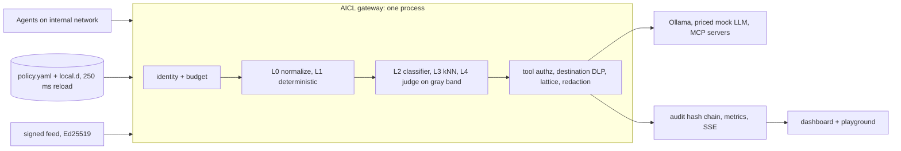

# 00 - Summary: SOT knowledge base for the AI Control Layer

Synthesis of 01-12 (research run 2026-10-03, twelve parallel slices, read-only except throwaway measurements in /tmp). Every claim is sourced in the numbered file in brackets. The issuer PDF "CRIETRIA AI Control Layer" wins over anything here. Decisions live in `13-architecture.md`; `draft-v2/` is the team's earlier draft (employee egress proxy), kept for facts and superseded as a design.

## Product in one line
A self-hosted, local-first control layer that every agent interaction must cross (agent -> LLM, agent -> MCP tool, agent -> memory, agent -> agent): it authenticates the agent, meters spend in tokens, USD and local GPU-seconds, runs deterministic checks and a semantic cascade, and decides allow / log / warn / redact / require approval / block from one hot-reloaded `policy.yaml` and a signed signature feed, with a hash-chained audit and a dashboard.

## Reading map

| File | Question | One-line answer |
|---|---|---|
| 01 | What must be protected, where, against what? | 13 paths, 3 enforcement points (LLM proxy, MCP proxy, SDK), 59 attack classes, 44-row control matrix, 15 priorities |
| 02 | Gateway, sidecar, SDK, mesh or eBPF? | hybrid (gateway + MCP proxy + SDK shim + internal Docker network) scores 52/60; Python hop 0.15-0.5 ms |
| 03 | Which protocols, and how to intercept MCP? | OpenAI chat + SSE, Ollama NDJSON, MCP 2026-07-28 and 2025-11-25, per-server proxy, `isError` denials |
| 04 | Deterministic detection without an LLM? | RE2 + Aho-Corasick + YARA-X, 30 validated patterns incl. Polish ids, 1-4 ms for 10 KB, span redaction with streaming hold-back |
| 05 | Which local models, how to fuse? | PIGuard ONNX (Wolf Defender small as gated alternative), e5-small kNN, qwen3.5:4b judge on gray band, veto lattice + calibrated categories |
| 06 | When is text a leak, and to whom? | destination matrix, markings / dictionaries / EDM, winnowing fingerprints (k=5, w=4), session taint |
| 07 | Who may call which tool? | RBAC + ABAC on arguments + attenuable short-lived JWT, approvals bound to argument digest, credential broker |
| 08 | Memory and budgets? | memory gateway with provenance and HMAC chain; SQLite reserve-then-settle in nano-USD, tokens, GPU-ms; loop guard |
| 09 | Signature feed and supply chain? | own `aicl-rules/1`, Ed25519 bundle with inline tests and 12-step verifier; pickle `genops` allowlist; Ollama admin shield |
| 10 | What exists, what is the gap? | gaps: local-model budgets, destination-aware DLP, signed feed with tests; Pipelock is the closest open competitor |
| 11 | Policy, reload, telemetry, dashboard? | typed YAML 1.2 + pydantic, polling reload with last-good; custom rules; HMAC-only audit; static FastAPI dashboard |
| 12 | How do we prove it? | pytest + per-control YAML cases, 58 cases, vendored public sets, garak before/after, 4:35 demo with fallbacks |
| 13 | What do we build? | decision record: architecture, protocols, engines, complete policy, schemas, 60 tests, plan, demo, risks |

Where each of the 30 sections of the research brief is answered: 1 threat model -> 01; 2 architecture options -> 02; 3 protocols and MCP -> 03; 4 inspection pipeline and 5 static analysis -> 04; 6 semantic analysis and 7 hybrid scoring -> 05; 8 DLP and 9 destination-aware DLP -> 06; 10 output inspection and redaction -> 04 sections 7-8; 11 tool-call security and 12 agent identity -> 07; 13 memory and 14 budgets -> 08; 15 attack feed and 16 supply chain -> 09; 17 policy schema, 18 policy engine, 19 observability, 20 dashboard -> 11; 21 test suite -> 12; 22 performance cascade -> 05 section 5 + 13 section 3; 23 technologies -> 13 section 16; 24 existing solutions and 25 innovative features -> 10; 26 diagram -> 02 section 8 + 13 section 2; 27 demo -> 12 section 6 + 13 section 22; 28 scope -> 13 section 19; 29 repository -> 13 section 20; 30 implementation plan -> 13 section 21 + `TASKS.md`. The 25 required final-output sections are `13-architecture.md` sections 1-25.

## Established (decision-relevant)

**Threats and taxonomies**
- Current revisions: OWASP LLM Top 10 2025 and the 2026 edition (2026-08-03, reordered: LLM03 Excessive Agency, LLM04 Supply Chain, LLM08 Hidden Context Exposure, LLM10 Improper Output Handling), OWASP Agentic Top 10 2026 (ASI01 Goal Hijack ... ASI10 Rogue Agents), OWASP MCP Top 10 (beta), MITRE ATLAS 2026.09 (208 techniques, 73 case studies), MCP spec 2026-07-28 [01][09].
- Channel matters more than content: instruction-like text in a user turn is a request, in a tool result, RAG chunk, MCP result or memory read it is an attack. Channel-aware thresholds are the main false-positive control [01][04].
- Exfiltration runs through rendering and tools (EchoLeak CVE-2025-32711: markdown images and reference links); deterministic channel controls beat classifiers there [01][04].

**Architecture and protocols**
- Pattern G (gateway + MCP proxy + SDK shim + egress enforcement) is the only one that is both hard to bypass and buildable in 24-48 h; Envoy ext_proc and eBPF are production layers [02].
- MCP 2026-07-28 is stateless (no `initialize`, no sessions, `Mcp-Method` / `Mcp-Name` headers must match the body; sampling, roots, logging deprecated), but most clients still speak 2025-11-25, so the proxy must pass both eras; token passthrough is forbidden; tool annotations are untrusted [03].
- Ollama 0.35.1 silently drops `tool_choice`, defaults `num_predict` to unlimited, sends stream usage only with `include_usage`, and its `-cloud` model tags leave the machine even on localhost [03][06][08].

**Detection**
- RE2 is mandatory for feed regexes (ReDoS); gitleaks rules with an Aho-Corasick prefilter run in 13 / 189 us on 1 / 10 KB [04].
- Normalize first (flags on the original, NFKC, invisibles, Unicode tags, 1:1 confusables), decode and rescan, keep one offset map for redaction [04].
- Classifiers fail both ways (adaptive attacks > 50-90% ASR; over-defense on trigger words), so they never gate authz, budgets, canaries or taint [05].
- Prompt Guard 2 and Llama Guard are gated custom licences; PIGuard (MIT) has the best published over-defense; Wolf Defender (Apache-2.0) ships official ONNX but only vendor metrics [05].

**DLP, tools, identity**
- Destination-aware DLP (data class x destination trust x identity) is absent from open-source gateways; Cloudflare's is per gateway [06][10].
- Winnowing (k=5 words, w=4) finds lightly edited pastes of protected documents with 0 false positives on 400 benign prompts; SimHash, ssdeep and TLSH cannot [06].
- Tool authz belongs at the execution point (MCP `tools/call`) with the gateway holding upstream credentials; LLM `tool_calls` are proposals [07].
- RFC 8693 `act` chains are informational; authorization uses narrowed scope and depth per exchange [07].

**Budgets, feed, supply chain**
- LiteLLM, agentgateway and Bifrost price local models at zero (LiteLLM: 29/29 Ollama entries), and LiteLLM skips budgets for zero-priced models [08][10].
- No signed, externally managed AI prompt-attack feed exists; we publish our own from own rules + CISA KEV + OSV `MAL-*` + converted public patterns [09].
- LiteLLM 1.82.7 / 1.82.8 on PyPI were malware (GHSA-5mg7-485q-xm76, traced to an exploited Trivy token) [09].
- `picklescan` has 20+ bypass advisories; claim "pickle blocked by default", never "scanned safe"; `modelscan` does not install on Python 3.13+, `fickling` is LGPL-3.0 [09].

**Policy, telemetry, testing**
- PyYAML parses `off` as `false` and accepts duplicate keys: use ruamel.yaml (YAML 1.2) + pydantic [11].
- Policy evaluation cost is irrelevant next to detection (Python rules 0.001 ms, cedarpy 0.069 ms, OPA REST 0.090 ms): choose for editability [11].
- OTel GenAI and MCP semantic conventions are Development status: reuse names, do not depend on a collector [03][11].
- Public data: NotInject (MIT, 339 benign), JBB benign (MIT), deepset test split (Apache-2.0), Gandalf test attacks (MIT) are vendorable; Qualifire (NC), WildJailbreak and HackAPrompt (gated), Tensor Trust (no licence) are not [12].

## Measured today on the M5 (throwaway code in /tmp)

| What | Result | File |
|---|---|---|
| Proxy hop FastAPI + httpx / + aiohttp | about 0.5 ms / 0.15 ms per request; 1.2-1.9k / 10.3k rps per worker | 02 |
| SSE per-event parsing | +0.36 ms to time-to-first-token | 02 |
| Docker `--internal` network | blocks internet and host ports, reaches a dual-homed gateway by name | 02 |
| MCP reverse proxy + stdio wrapper with `mcp` 2.3.0, both eras | worked; +0.74 ms p50; pinning 100 tools 0.34 ms | 03 |
| gitleaks rules (221) with prefilter | 13 us / 189 us on 1 / 10 KB (plain RE2 loop 0.45 / 4.0 ms) | 04 |
| ReDoS `(a+)+$`, n=28 | stdlib `re` 11.2 s, RE2 0.09 ms | 04 |
| Streaming redaction | equal to one-shot over 900 random chunkings | 04 |
| NFKC / tag scan / 60 stdlib regexes on 10 KB | 6 us / 31 us / 1.7 ms | 01 |
| Winnowing fingerprints, 1,000 docs | 50/50 at 10% edits, 47/50 at 20%; 0 FP on 400 benign; query 0.3 ms; 2.3 MB | 06 |
| Presidio + `en_core_web_sm` / GLiNER-pii-edge | 7.2 ms / 20 ms CPU | 06 |
| sqlglot SQL check / shell argv check | 0.18 ms p50 / 4.5 us | 07 |
| EdDSA JWT sign / verify | 0.018 / 0.049 ms | 07 |
| SQLite reserve + settle | p50 0.073 ms, 3 legs 0.217 ms; 20 parallel vs cap 4 -> exactly 4 admitted | 08 |
| GCRA rate check | 0.19 us; 3/min -> Retry-After 19.7 s | 08 |
| Token estimate | tiktoken o200k within 7% of Qwen3; `chars/4` under-counts Polish by 24%; `bytes/3` never under-counts | 08 |
| Feed verify (Ed25519 + RE2, 15 rules, 61 inline tests) | 0 failures; full check 0.45 ms per rule; sign 13.6 us | 09 |
| Pickle `genops` allowlist scanner | 9/9 malicious blocked, 3/3 benign allowed, 20 MB/s | 09 |
| Policy evaluation | Python rules 0.001 ms, cedarpy 0.069 ms, OPA REST 0.090 ms p50 | 11 |
| prometheus-client observe / structlog JSON | 0.62 us / 5 us p50 | 11 |
| NumPy kNN 10k x 1,024 | 0.68 ms p50 / 1.25 ms p95 | 05 |

Not measured: classifier, embedding and judge inference on the M5 (downloads stalled; the shared Ollama was off limits), end-to-end gateway latency, real Polish false-positive rates.

## Inconsistent
- OWASP LLM 2026 edition date: page 2026-08-03 vs secondary 08-04 vs press text "September" [09][11].
- Gateway benchmarks are vendor-run (Bifrost 11 us claim vs 4.5 ms p99 in LiteLLM's competitor benchmark) [02].
- PIGuard (peer-reviewed, English) vs Wolf Defender (vendor metrics, multilingual, official ONNX): 05 ranks PIGuard first; 13 lets the dev-set gate decide [05][13].
- Upstream client: httpx (one client everywhere, `mcp` SDK uses it) vs aiohttp (3x lower hop latency) [02][03]; 13 picks httpx, aiohttp is the upgrade path.
- LangGraph `recursion_limit` default changed from 25 to 10000 / 10007 in 1.1-1.2 [08].
- Lakera and Prompt Security acquisition prices disagree between sources [10].

## Could not establish
- Inference latency of any classifier, embedding model or judge on the M5 under the shared Ollama load; whether `eval_count` includes qwen3.5 thinking tokens [05][08].
- Polish injection-detection quality of any model; independent Wolf Defender evaluation [05].
- Primary text of the OWASP Agentic Top 10 PDF (ids taken from vendor summaries) [01][07].
- How real MCP clients surface `isError` vs JSON-RPC errors, and their behaviour on a 20 s approval hold [03][07].
- Docker Desktop file-event reliability on bind mounts (polling chosen regardless) [11].
- Licences of some red-team corpora bundled inside larger benchmarks (BIPIA, AgentDojo suites, Spikee data) [12].

## Further
- Design, plan and demo: `13-architecture.md`. Task board: `TASKS.md`. Process: `AGENTS.md`.
- The employee egress-proxy design (PAC + CA + mitmproxy, per-app adapters, legal notes) is in `draft-v2/07-10`; it is the roadmap for a browser ingress adapter on the same `decide()` core.
