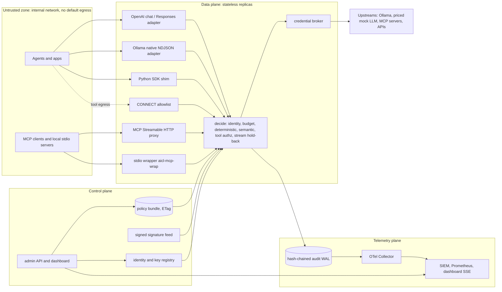
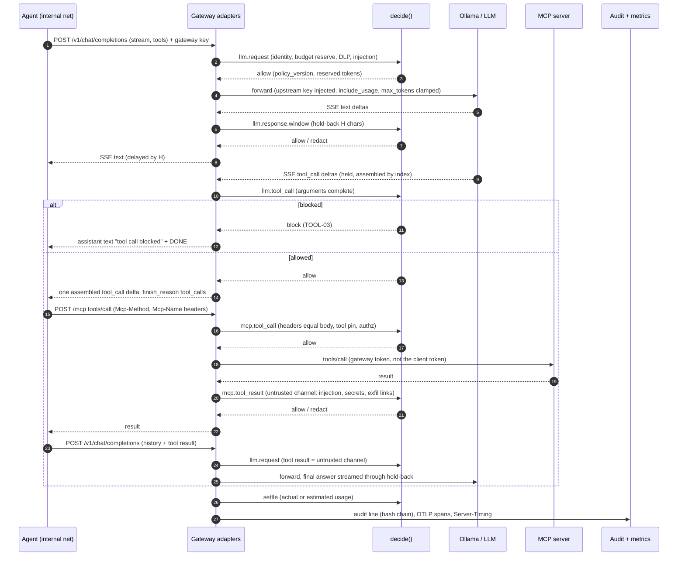

# 02 - Architecture options: where and how should the control layer intercept traffic, for a 24-48 h MVP and for production?

Verified 2026-10-03 against primary sources. Legend: `[EST]` established technique, `[EXP]` experimental / research-grade, `[REC]` our architectural recommendation, `[INFERENCE]` reasoning not read anywhere, `[MEASURED]` run locally today.

Revisions: MCP spec 2026-07-28 ([Streamable HTTP](https://modelcontextprotocol.io/specification/2026-07-28/basic/transports/streamable-http), [stdio](https://modelcontextprotocol.io/specification/2026-07-28/basic/transports/stdio)); Envoy v1.39.1, Istio 1.31.1, Tetragon v1.7.1, Falco 0.45.0, Tracee v0.24.1 (2025-11-19), eCapture v2.6.0, OPA v1.21.1, SPIRE v1.15.3, Valkey 9.1.2, OTel Collector v0.162.0 (`gh api .../releases/latest`; Apache-2.0 except Valkey BSD-3; none archived). Prior team notes (`ai_layer_control/research/00, 02, 03, 04, 05`) used for facts only; this file covers the agent / LLM / MCP path.

[MEASURED] setup: throwaway venv (Python 3.14.8, versions in section 5, httpx 0.28.1) plus a Go 1.26.4 mock upstream / reverse proxy / load generator on the Apple M5, same host, no TLS, ~1.1 KB JSON, 4 s per run, one run per cell, laptop shared (load average 3-8): order of magnitude only. Ollama was not touched.

## 1. Implementation patterns A-G compared

Scale 1-5, higher = better for us (5 = easiest, lowest overhead, hardest to bypass, cheapest to deploy). Scores are `[INFERENCE]` from the evidence in the narratives.

| Criterion | A reverse proxy / AI gateway | B sidecar per agent | C SDK / middleware | D MCP gateway | E mesh (Envoy ext_proc) | F eBPF / runtime | G hybrid |
|---|---|---|---|---|---|---|---|
| Implementation simplicity | 4 | 3 | 4 | 3 | 2 | 1 | 3 |
| Developer transparency | 4 | 4 | 1 | 3 | 4 | 5 | 4 |
| Protocol coverage | 3 | 3 | 2 | 2 | 5 | 3 | 5 |
| Request inspection | 5 | 5 | 5 | 5 | 4 | 2 | 5 |
| Response inspection incl. streaming | 4 | 4 | 4 | 4 | 3 | 1 | 4 |
| Performance overhead (5 = lowest) | 4 | 4 | 5 | 4 | 4 | 4 | 4 |
| Scalability | 4 | 3 | 5 | 4 | 5 | 4 | 4 |
| Security (resistance to bypass) | 3 | 4 | 1 | 3 | 4 | 4 | 5 |
| Deployment simplicity | 4 | 2 | 5 | 3 | 1 | 1 | 3 |
| Compatibility with agents / MCP / LLM APIs | 4 | 4 | 3 | 4 | 4 | 3 | 5 |
| Identity enforcement | 4 | 5 | 2 | 4 | 5 | 3 | 5 |
| Budget enforcement | 5 | 3 | 3 | 3 | 3 | 1 | 5 |
| **Sum (max 60)** | **48** | **44** | **40** | **42** | **43** | **32** | **52** |
| **MVP 24-48 h feasibility** | **5** | 3 | **5** | 4 | 1 | 1 | **4** |

[REC] Pattern G built as: A (OpenAI + Ollama gateway) + D (MCP proxy, HTTP and stdio wrapper) sharing one `decide()` core, a thin C shim calling the same core in-process, and network egress enforcement so A and D cannot be skipped. E and F are documented production layers.

**A. Reverse proxy / AI gateway.** Client only changes a base URL (`OPENAI_BASE_URL` in [openai-python](https://github.com/openai/openai-python/blob/main/src/openai/_client.py), `ANTHROPIC_BASE_URL` in [anthropic-sdk-python](https://github.com/anthropics/anthropic-sdk-python/blob/main/src/anthropic/_client.py), `OLLAMA_HOST` in [ollama-python](https://github.com/ollama/ollama-python/blob/main/ollama/_client.py)). Sees prompts, tool definitions, tool calls and usage in clear text; owns budgets and keys. Weak spots: only implemented protocols (Ollama serves `/v1/chat/completions`, `/v1/responses` and native NDJSON `/api/*`: [compat doc](https://github.com/ollama/ollama/blob/main/docs/api/openai-compatibility.mdx), [streaming](https://docs.ollama.com/api/streaming)); bypassable without egress and credential control (section 3). Overhead 0.1-0.5 ms per hop in Python `[MEASURED]`.

**B. Sidecar per agent.** One instance per agent (compose `network_mode: service:agent`, K8s injection): loopback hop, per-workload identity, per-agent kill switch; but N copies of state (budgets need a shared store). An Envoy sidecar at 1000 rps / 1 KB costs ~0.20 vCPU and 60 MB, ambient ztunnel 0.06 vCPU / 12 MB ([Istio performance](https://istio.io/latest/docs/ops/deployment/performance-and-scalability/)). [REC] sidecar only for stdio MCP wrappers.

**C. SDK / middleware.** [OpenAI Agents SDK guardrails](https://openai.github.io/openai-agents-python/guardrails/): input guardrails run only for the first agent, output guardrails only for the agent producing the final output, tool guardrails cover function tools and local MCP servers; hosted tools and built-in execution tools (`ShellTool`, `ComputerTool`, `HostedMCPTool`) do not use the tool-guardrail pipeline; default parallel mode lets the expensive model start before the tripwire (`run_in_parallel=False` blocks first). [LangChain middleware](https://docs.langchain.com/oss/python/langchain/middleware/overview) hooks before/after each model and tool call (PII detection, rate limits, human-in-the-loop). Exact structured data, but it runs inside the agent's trust domain: importing the raw client skips it, and coverage depends on framework internals. Use as a friendly entry point to the same `decide()`, never as the only layer.

**D. MCP gateway.** Spec 2026-07-28: one POST endpoint, each JSON-RPC message its own POST, JSON or per-request SSE answer, no protocol sessions, no GET stream, no `Last-Event-ID`; `Mcp-Method`, `Mcp-Name`, `Mcp-Param-*` headers mirror the body and a mismatch MUST be rejected 400 `HeaderMismatch` (-32020); an intermediary routing on headers SHOULD reject older protocol versions. 2025-era clients still use `Mcp-Session-Id`, GET streams and server-initiated requests, so a demo gateway needs both eras; Microsoft's [MCP Gateway](https://github.com/microsoft/mcp-gateway) already dropped legacy ("requires MCP 2026-07-28 clients"). stdio: the client spawns the server, newline-delimited JSON-RPC on stdin/stdout, no headers, so a stdio proxy is a command wrapper. A proxy that spawns stdio servers is an RCE escalation path if its token leaks: allow only pinned commands, sandbox, log ([security doc](https://modelcontextprotocol.io/specification/2026-07-28/basic/security_best_practices)). Aggregation: one endpoint, many servers, tools exposed as `<server>__<tool>` `[REC]` so authz, pinning and audit key on one name. Token passthrough to upstream is forbidden (same doc). Weak spots: MCP only (no view of the model unless A is also in path); direct client-to-server access bypasses it.

**E. Service mesh.** [ext_proc](https://www.envoyproxy.io/docs/envoy/latest/configuration/http/http_filters/ext_proc_filter): bidirectional gRPC stream to a processor that inspects/mutates headers, body, trailers or answers itself. [Body modes](https://github.com/envoyproxy/envoy/blob/main/api/envoy/extensions/filters/http/ext_proc/v3/processing_mode.proto): `NONE`, `STREAMED`, `BUFFERED`, `BUFFERED_PARTIAL`, `FULL_DUPLEX_STREAMED` (processor may buffer then re-chunk), `GRPC` (marked not implemented). Per-message timeout defaults to 200 ms and `failure_mode_allow` to false, i.e. fail-closed 504/500 ([proto](https://github.com/envoyproxy/envoy/blob/main/api/envoy/extensions/filters/http/ext_proc/v3/ext_proc.proto)); a 0.3-1.2 s judge inline needs a larger `message_timeout`. `observability_mode` = detect only. [ext_authz](https://www.envoyproxy.io/docs/envoy/latest/configuration/http/http_filters/ext_authz_filter) is allow/deny on headers (+ optional body), no response path; Istio wires it via a [CUSTOM AuthorizationPolicy](https://istio.io/latest/docs/tasks/security/authorization/authz-custom/). Wins: any HTTP/gRPC protocol, mTLS identity, scale. Costs: Kubernetes, CRDs, Envoy on macOS only in Docker, two languages. [REC] production adapter only (section 7).

**F. eBPF / runtime.** [Tetragon](https://tetragon.io/docs/concepts/enforcement/) enforces in-kernel by overriding a hook's return value or signalling; a SIGKILL from a `write()` hook "does not guarantee that the data will not be written", so pair `Signal` with `Override`. [Falco](https://github.com/falcosecurity/falco) "detect and alert"; [Tracee](https://github.com/aquasecurity/tracee) observability/detection. TLS plaintext via uprobes on `SSL_read`/`SSL_write`: [eCapture](https://github.com/gojue/ecapture) covers OpenSSL, LibreSSL, BoringSSL, GnuTLS, NSS and Go TLS, read-only, needs root, aarch64 kernel 5.5+, "Does not support Windows or macOS". Enforces exec, file open, connect by process; cannot understand or rewrite a prompt, count tokens or mutate a TLS stream, and cannot see stacks without hookable libssl (rustls, static builds) `[INFERENCE]`. macOS: no eBPF; Tracee runs only in a Linux VM and then sees only that VM ([FAQ](https://github.com/aquasecurity/tracee/blob/main/docs/docs/install/mac-faq.md)) (Colima/Docker Desktop are such VMs). Native equivalents: Apple [Endpoint Security](https://developer.apple.com/videos/play/wwdc2020/10159/) (AUTH events hold exec/open until answered, deadline then client killed) and [Network Extension](https://developer.apple.com/videos/play/wwdc2019/714/) `NEFilterDataProvider` (read-only, allow/drop verdict only), both system extensions needing entitlements and user approval. NOT RECOMMENDED FOR HACKATHON MVP: F -> use the Docker `internal` network plus a command allowlist in the stdio wrapper; mention Tetragon as the production backstop for "agent spawns `curl | sh`".

**G. Hybrid layers** `[REC]`:

| Layer | Catches | Only layer that catches |
|---|---|---|
| L0 network: demo agent on an internal network, only the gateway dual-homed | direct-to-LLM / direct-to-MCP / raw sockets | bypass by a misbehaving agent |
| L1 gateway: LLM (A) + MCP (D) + optional CONNECT allowlist | prompts, tool calls, results, budgets, identity | all content-level controls |
| L2 SDK shim (C), same `decide()` in-process | local functions and memory stores that never use the network | non-network tools |
| L3 stdio wrapper (D with B placement) | local stdio MCP servers | stdio traffic |
| L4 runtime (F), production | exec/file/connect by the agent process | post-compromise behaviour |

## 2. Pattern evidence: which products use which pattern (architecture only)

| Product | Pattern | Architecture in one line |
|---|---|---|
| [LiteLLM proxy](https://docs.litellm.ai/docs/simple_proxy) | A (+C, +D) | Python OpenAI-compatible reverse proxy, virtual keys, Postgres, [guardrail hooks](https://docs.litellm.ai/docs/proxy/guardrails/quick_start); also an SDK and MCP gateway; Rust gateway in beta. |
| [Portkey gateway](https://github.com/Portkey-AI/gateway) | A | TypeScript OpenAI-compatible gateway with guardrails. |
| [Kong AI Gateway](https://developer.konghq.com/ai-gateway/) | A on an API gateway | [`ai-proxy`](https://developer.konghq.com/plugins/ai-proxy/) and guard plugins in the Kong data plane. |
| [Envoy AI Gateway / Agent Router](https://github.com/theagentrouter/agent-router) | E | K8s control plane (CRDs `AIGatewayRoute`, `AIServiceBackend`) configuring Envoy, with an `extproc` service in the path. |
| [agentgateway](https://github.com/agentgateway/agentgateway) | A + D | Rust proxy for LLM, MCP and A2A with per-key budgets, CEL authz and guard call-outs. |
| [Docker MCP Gateway](https://github.com/docker/mcp-gateway) | D + container isolation | CLI plugin running MCP servers as containers behind one gateway over stdio, SSE or streaming (`docker mcp gateway run --port 8080 --transport streaming`); [message flow](https://github.com/docker/mcp-gateway/blob/main/docs/message-flow.md). |
| [Microsoft MCP Gateway](https://github.com/microsoft/mcp-gateway) | D (K8s data + control plane) | Reverse proxy and lifecycle manager, stateless per-request routing and authorization. |
| [IBM ContextForge](https://github.com/IBM/mcp-context-forge) | D + registry | Python registry/proxy federating MCP, A2A, REST; plugin hooks; `mcpgateway.translate` bridges stdio to SSE/HTTP. |
| [Lasso MCP Gateway](https://github.com/lasso-security/mcp-gateway) | D (stdio proxy) | Reads `mcp.json`, spawns and proxies listed servers, plugin sanitizers. |
| [Invariant Gateway](https://github.com/invariantlabs-ai/invariant-gateway) (Snyk) | A + D | "Change the base URL" LLM proxy plus MCP stdio/SSE/streamable proxy that traces and guardrails. |
| [Cloudflare AI Gateway](https://developers.cloudflare.com/ai-gateway/get-started/) | A (SaaS) | Hosted URL `gateway.ai.cloudflare.com/v1/{account}/{gateway}/{provider}`, BYOK key store, [guardrails](https://developers.cloudflare.com/ai-gateway/features/guardrails/) on prompt and response (flag or block). |
| [NeMo Guardrails](https://github.com/NVIDIA-NeMo/Guardrails) | C (+ server) | In-process rails; a FastAPI server exposes `/v1/chat/completions` ([doc](https://github.com/NVIDIA-NeMo/Guardrails/blob/develop/docs/run-rails/using-fastapi-server/chat-with-guardrailed-model.mdx)). |
| [Guardrails AI](https://github.com/guardrails-ai/guardrails) | C (+ server) | Validator library; `guardrails start` runs it as a REST service. |
| [LlamaFirewall](https://github.com/meta-llama/PurpleLlama/tree/main/LlamaFirewall) | C | Scanner library (PromptGuard 2, AlignmentCheck, CodeShield) called around model and tool steps. |

Reading: the C libraries all grew a server mode (A): enforcement must live outside the agent.

## 3. Forcing agent traffic through the layer without code changes

| Mechanism | Covers | Reliability | Bypass | MVP |
|---|---|---|---|---|
| `OPENAI_BASE_URL` / `base_url` | OpenAI SDKs ([python](https://github.com/openai/openai-python/blob/main/src/openai/_client.py), [node](https://github.com/openai/openai-node/blob/master/src/client.ts)) and Agents SDK on top | High if cooperative | code sets its own base URL or another SDK; mitigate with L0 | yes |
| `ANTHROPIC_BASE_URL` + managed settings | Claude Code: `allowedProviders: ["customEndpoint"]` plus the gateway URL in managed settings makes it refuse any other endpoint (v2.1.285+, [doc](https://code.claude.com/docs/en/llm-gateway)) | High, vendor-enforced | unmanaged machine | cite for production |
| `OLLAMA_HOST` | ollama-python / CLI clients | High for Ollama clients | hardcoded `localhost:11434`. [REC] Ollama is shared here: do not move it, run the gateway on its own port and set `OLLAMA_HOST=http://gateway:4000` | yes |
| MCP client config | `url` at the gateway, or `command` replaced by `aicl-mcp-wrap -- <server cmd>` | High if the config is managed | user adds a direct entry | yes |
| `HTTP(S)_PROXY` | tool egress (httpx `trust_env=True` by default, [source](https://github.com/encode/httpx/blob/master/httpx/_client.py)); HTTPS is an opaque CONNECT tunnel (host:port only) unless TLS is terminated | Medium: Node needs `NODE_USE_ENV_PROXY=1` (v22.21+/v24.5+) and only covers `fetch` ([PR 57165](https://github.com/nodejs/node/pull/57165/)); libraries with own proxy settings skip it | raw sockets, other protocols, DNS | stretch: host allowlist at CONNECT, no MITM |
| Docker network without default egress | everything the containerised agent does | highest on a laptop | gateway compromise, published ports | yes |
| Credential brokering | agent holds only `aicl_<agent>_<random>`; provider keys and MCP tokens stay in the gateway | makes a bypass useless | agent holds another key | yes |


[MEASURED] Docker (Colima; alpine:3, caddy:2 already local): a container on `docker network create --internal` cannot reach `1.1.1.1`, cannot reach a host-side port, but reaches a gateway container attached to both that network and a normal one by service name (`http://aicl-t-gw:8080/` returned `gw-ok`); the dual-homed container itself reached the internet. Test containers/networks were removed.

```yaml
# docker-compose.yml fragment [REC]
services:
  gateway:
    networks: [agentnet, upstream]       # dual-homed: the only way out
    ports: ["127.0.0.1:4000:4000"]
    secrets: [upstream_keys]             # real provider keys live only here
  agent:
    networks: [agentnet]                 # no default route out
    environment:
      OPENAI_BASE_URL: http://gateway:4000/v1
      OPENAI_API_KEY: aicl_agent7_k3y    # gateway-issued, worthless elsewhere
      OLLAMA_HOST: http://gateway:4000
networks:
  agentnet: {internal: true}             # compose reference: networks.internal
  upstream: {}
```

Credential brokering is the vendors' own pattern: [Claude Code gateway doc](https://code.claude.com/docs/en/llm-gateway) ("the provider key stays server-side; developers hold gateway credentials"), [Cloudflare BYOK](https://developers.cloudflare.com/ai-gateway/get-started/). For MCP the gateway uses its own upstream tokens; client tokens are never forwarded. Reliable: base-URL override for cooperative clients, internal network, brokered credentials. Bypassable: env vars, `HTTPS_PROXY`, SDK-only controls, editable MCP configs.

## 4. Streaming and long-lived connections

Shapes: OpenAI chat completions streams SSE (`data: {chunk}\n\n`, final `data: [DONE]`); tool calls arrive as `delta.tool_calls[{index,id,function:{name,arguments}}]` with `arguments` a partial JSON string concatenated per `index`, only the first chunk carries `id` ([function calling](https://developers.openai.com/api/docs/guides/function-calling); openai-python needed fixes for duplicate-index entries in the first chunk, [PR 3446](https://github.com/openai/openai-python/pull/3446)). Ollama native `/api/chat` and `/api/generate` stream NDJSON by default, so an SSE-only gateway breaks the `ollama` client. The Agents SDK defaults to the Responses API ([models doc](https://github.com/openai/openai-agents-python/blob/main/docs/models/index.md)); [REC] demo agent on Chat Completions (`set_default_openai_api("chat_completions")`, [config](https://openai.github.io/openai-agents-python/config/)), `/v1/responses` is stretch. Ollama's chat completions endpoint does not support `tool_choice`.

| Stream policy (per control) | Client sees | Redaction | Cost |
|---|---|---|---|
| `buffer` | nothing until the full answer is scanned, then a re-stream | yes | kills time-to-first-token |
| `holdback` | text delayed by a tail window H | yes (match inside the window) | TTFT + ~H |
| `passthrough_terminate` | text immediately, cut on violation | no | bytes already sent |

Prior art: NeMo output rails run per chunk of 200 tokens with 50 tokens of carried context; `stream_first: True` = client gets tokens before the rail runs ("if a rail blocks the content, the user has already received the tokens"; stream ends with a JSON error), `False` = rail first ([doc](https://github.com/NVIDIA-NeMo/Guardrails/blob/develop/docs/configure-rails/yaml-schema/streaming/output-rail-streaming.mdx)). agentgateway: `mask` does not apply to streamed responses, only `reject` (prior note 02).

Hold-back `[REC]`:
```text
H = max(longest span of enabled stream rules, 64) chars      # AWS key 20, PEM header 40, JWT ~300
on chunk: text_buf += delta.content ; for t in delta.tool_calls: calls[t.index].args += t.arguments   # tool deltas NOT forwarded
  d = decide(Event("llm.response.window", text_buf, channel="assistant"))
  block   -> emit error event + [DONE], close, settle budget (nothing unsafe released yet)
  else    -> safe = redact(text_buf)[:-H] ; emit(safe) ; text_buf = unreleased tail
on finish_reason == "tool_calls": parse args only now ; decide(Event("llm.tool_call", name, args))
  allow -> emit ONE delta per call (id+name+full args, single index)      [INFERENCE: SDK accumulators accept it]
  block -> emit assistant text "tool call blocked by policy <rule_id>", finish_reason "stop"
on [DONE]: final decide on the tail, flush, emit usage chunk (stream_options.include_usage injected)
```
Semantic stage: 200-token windows, 50 overlap (NeMo defaults as a start), verdict `terminate` only.

When to block mid-stream: (a) deterministic hit inside the window: redact and continue; (b) harm/policy hit after release: terminate with a final `data: {"error":{"type":"policy_block","rule":"..."}}` then `[DONE]`; clients see truncated text and an API/parse error, optionally `finish_reason: "content_filter"` `[INFERENCE: verify per SDK]`; (c) tool call: never forwarded before the decision. MCP: `tools/call` results are one JSON body or a short SSE, scanned whole before release; the long-lived `subscriptions/listen` stream carries `notifications/tools/list_changed`, which must trigger a tool re-pin check (rug pull).

| Transport | MVP | Reason |
|---|---|---|
| SSE (OpenAI, MCP) | **in** | demo path |
| NDJSON (Ollama native) | **in** | `ollama` client streams by default; same inspector, other framing |
| Chunked bodies | **in** (transparent) | inspect after the full body, cap size |
| WebSocket (OpenAI [Realtime](https://developers.openai.com/api/docs/guides/realtime-websocket); Agents SDK opt-in `use_responses_websocket`) | **out**: refuse Upgrade, fail closed, audit `ws_refused` | stateful audio/event protocol; Agents SDK defaults to HTTP |
| gRPC | **out** | Envoy's own `GRPC` body mode is not implemented; LLM APIs are HTTP/JSON |
| A2A, WebRTC, SIP | out | document only |

## 5. Gateway language / runtime

Published numbers (vendor-run or vendor-adjacent, mock upstream, no model latency):

| Source | Result | Methodology |
|---|---|---|
| [LiteLLM benchmarks](https://docs.litellm.ai/docs/benchmarks) | "8ms P95 latency at 1k RPS"; overhead header: 2 instances median 12 / p95 29 / p99 43 ms; 4 instances 2 / 8 / 13 ms | 4 CPU / 8 GB per instance, Locust 1000 users with 0.5-1 s think time (~130 in flight), fake OpenAI endpoint, Postgres; page notes closed-loop clients inflate latency (Little's law) |
| [TensorZero](https://github.com/tensorzero/tensorzero/blob/main/docs/gateway/benchmarks.mdx) (archived 2026-06) | LiteLLM 1.74.9 mean 4.91 ms @100 QPS, 7.45 @500, fails @1000; TensorZero (Rust) mean 0.37 ms @10,000 QPS | c7i.xlarge, load generator + gateway + mock on one box, July 2025 |
| [agentgateway vs LiteLLM](https://agentgateway.dev/blog/2026-06-26-benchmarking-agentgateway-vs-litellm/) | agentgateway 36,933 QPS, p50 0.831 / p99 1.970 ms, 22 MB; LiteLLM (18 workers) 3,198 QPS, p50 7.076 / p99 32.192 ms, 11.8 GB | fortio, 32 connections, unlimited QPS, 1 KB, 3 s ([scripts](https://github.com/linsun/litellm-agw-perf)) |
| [LiteLLM AIGatewayBench](https://docs.litellm.ai/blog/rust-ai-gateway-benchmarks) | p99 added latency: LiteLLM Rust 0.7 ms, Portkey 2.3, Bifrost 4.5, LiteLLM Python 257.7; 30-turn coding-agent loop adds 0.03 s (Rust) vs 0.97 s (Python) | overhead = gateway path minus direct path, n=5000, single host, no callbacks, no error bars ([harness](https://github.com/BerriAI/ai-gateway-bench)) |


[MEASURED] on the M5 (this work): Go load generator -> gateway -> Go mock; non-streaming 1.1 KB JSON; "direct" = generator -> mock. Python variants include orjson parse and 8-12 RE2 patterns over prompt and response unless "pass".

| Path | conc 1: p50 / p99 | conc 8: rps, p50 | conc 32: rps, p50 / p99 | stream TTFT p50 (30 SSE events, 2 ms apart) |
|---|---|---|---|---|
| direct (Go mock) | 0.05 / 0.12 ms | 79k, 0.09 ms | 102k, 0.25 / 1.27 ms | 0.14 ms |
| Go `httputil.ReverseProxy` | 0.09 / 0.43 ms | - | 27k, 1.07 / 2.94 ms | 0.26 ms |
| Python FastAPI + **httpx**, pass | 0.51 / 0.72 ms | 1.2k, 5.2 ms | 1.0k, 24.5 / 118 ms | 0.86 ms |
| same + decide + response scan | 0.53 / 0.88 ms | 1.2k, 5.1 ms | - | 1.22 ms (SSE parsed per event) |
| same, 4 uvicorn workers | - | 5.2k, 1.6 ms | 3.0k, 8.1 / 41 ms | - |
| Python FastAPI + **aiohttp** upstream, decide + scan | **0.15 / 0.24 ms** | **10.3k, 0.76 ms** | **10.5k, 2.95 / 4.76 ms** | 0.82 ms (raw stream pass) |

Findings: (1) the scan is nearly free: ~12 RE2 patterns + orjson cost ~0.02 ms p50; parsing every SSE event costs ~+0.36 ms TTFT. (2) In Python the HTTP client dominates: httpx -> aiohttp took one worker from ~1.2-1.9k to ~10k rps and the hop from ~0.5 to ~0.15 ms; httpx 0.28.1 was last released 2024-12-06 (repo active, pushed 2026-10-02). (3) Detection dominates the budget anyway: deterministic < 1 ms, in-process encoders 20-80 ms, local judge 0.3-1.2 s (prior note 03, `[INFERENCE]`, not measured here) vs a 0.15-0.5 ms Python hop: 0.01-0.1% of a judged request. Language matters only for high-RPS fast calls (embeddings, classifiers) and long agent loops (30 turns x hop); the Go proxy added 0.04 ms at conc 1.

[REC] **Python 3.13/3.14 + FastAPI/Starlette + uvicorn (uvloop, httptools) + aiohttp upstream client + orjson + google-re2**, one worker for the demo. Versions/licences (PyPI 2026-10-03): fastapi 0.142.2 MIT; uvicorn 0.54.0 BSD-3; starlette 1.7.0 BSD-3; aiohttp 3.14.3 Apache-2.0 AND MIT; uvloop 0.23.0 MIT (cp314 arm64 installed); orjson 3.12.0 MPL-2.0 AND (Apache-2.0 OR MIT), use unmodified; google-re2 1.1.20251105 (repo google/re2 BSD-3); watchfiles 1.3.0 MIT; mcp 2.3.0 MIT; valkey-py 6.1.1 MIT. NOT RECOMMENDED FOR HACKATHON MVP: Go/Rust data plane from scratch -> keep Python, make the production data plane a swap-in (agentgateway / Envoy) that calls the same core over gRPC or webhook (build-vs-buy scoring: prior note 02).

## 6. MVP recommendation

One gateway process (decision core + all ingress adapters, one asyncio app) plus a few containers that make the story honest: feed publisher, mock "commercial" upstream, MCP servers, demo agent. Native Ollama stays on the host, untouched, reached only by the gateway (it is unreachable from an `internal` network).

```python
decide(event: Event, policy: PolicySnapshot, ctx: Ctx) -> Decision   # pure except budget/state stores
```
```json
{"event": {"id":"01JB...","kind":"llm.tool_call","agent_id":"agent7","session_id":"s-42","channel":"assistant",
           "model":"qwen3.5:4b","tool":{"server":"files","name":"files__read_file","args":{"path":"/etc/passwd"}},
           "meta":{"transport":"openai-chat-sse","bytes":412}},
 "decision": {"action":"block","reasons":[{"control":"TOOL-03","rule_id":"path.sensitive","severity":"high","score":1.0}],
              "redactions":[],"budget":{"reserved_tokens":0,"remaining_tokens":84210},
              "policy_version":"sha256:9f2c...","latency_us":{"identity":40,"deterministic":310,"semantic":0},"degraded":false}}
```
Event kinds: `llm.request`, `llm.response.window`, `llm.tool_call`, `mcp.tools_list`, `mcp.tool_call`, `mcp.tool_result`, `http.egress`. Actions: `allow | redact | block | hold` (hold = human approval bound to session, tool, args hash).

Components and effort (developer-hours, `[INFERENCE]`; transport and plumbing only, detectors, policy format, audit, dashboard and tests are other slices):

| Component | Responsibility | h |
|---|---|---|
| `core/decide.py` + schemas | pipeline identity -> budget reserve -> deterministic -> semantic (gray band) -> decision; in-process testable | 3 |
| `ingress/openai_chat.py` | `/v1/chat/completions`, `/v1/models`, include_usage injection, SSE hold-back, tool_call assembly, provider-shaped errors | 7 |
| `ingress/ollama_native.py` | `/api/chat`, `/api/generate` NDJSON; default-deny `/api/pull`, `create`, `push`, `delete`, `copy` | 3 |
| `ingress/mcp_http.py` | POST-only 2026-07-28 proxy: `Mcp-*` header vs body check, `tools/list` pin + namespacing, `tools/call` decide, result scan, 2025-era `Mcp-Session-Id` mapping, `listen` passthrough | 7 |
| `ingress/mcp_stdio.py` (`aicl-mcp-wrap -- cmd`) | spawn pinned command, line-oriented JSON filter both ways, same `decide()` | 3 |
| `sdk.py` | `secure_llm.call()`, `secure_tool.execute()`, `secure_mcp.call()` over `decide()`; Agents SDK tool-guardrail adapter | 3 |
| `broker.py` | gateway key -> agent identity, upstream key injection, strip client `Authorization` | 2 |
| `egress/connect_allowlist.py` (stretch) | `CONNECT` host allowlist, no MITM | 3 |
| compose + networks | internal agent net, dual-homed gateway, secrets file | 2 |
| `/health`, `Server-Timing` | degraded-mode announcement, per-stage latency | 2 |
| **Total** | about 35 h, parallel across 2-3 people | |

Cut first, in order: CONNECT allowlist; `/v1/responses`; MCP legacy-era session mapping (pin demo clients to one era); Agents-SDK adapter; stdio wrapper. Never cut: credential brokering, internal network, path allowlist, tool-call assembly, `policy_version` on every audit line. Diagram 8.3 is the demo acceptance path.

## 7. Production evolution

- **Data plane**: stateless gateway replicas (or Envoy/agentgateway in front of a decision service) behind an L4 balancer; each request pinned to one policy snapshot id; only durable local state is the last-good bundle.
- **Control plane**: policy and signature distribution, identity/key registry, admin API and dashboard, budget definitions; never in the request path.
- **Telemetry plane**: OTLP from gateways to the [OTel Collector](https://opentelemetry.io/docs/collector/), fan-out to SIEM and metrics; audit first appended to a local hash-chained WAL. GenAI and MCP semantic conventions moved to [semantic-conventions-genai](https://github.com/open-telemetry/semantic-conventions-genai) (status Development; its [MCP page](https://github.com/open-telemetry/semantic-conventions-genai/blob/main/docs/gen-ai/mcp.md) says to use MCP conventions, not generic RPC/HTTP ones).

| Concern | Production choice | Note |
|---|---|---|
| Policy distribution | pull-based signed bundle with `ETag` / `If-None-Match`, jittered polling, persisted last-good: OPA bundle model (`polling.min_delay_seconds 10`, `max 20`, `persist: true`, `signing`; [doc](https://github.com/open-policy-agent/opa/blob/main/docs/docs/management-bundles/index.md)) | MVP: file watch, 1 s |
| Counters / budgets | Valkey (BSD-3-Clause) Lua reserve/settle; MVP SQLite `BEGIN IMMEDIATE` (Redis 8 licensing: prior note 05) | local lease so a Valkey outage does not stop every request |
| Identity | SPIFFE/SPIRE ([concepts](https://spiffe.io/docs/latest/spiffe-about/spiffe-concepts/)): `spiffe://org/agent/<name>`, X.509-SVID mTLS between services, JWT-SVID for HTTP; gateway keys stay for third-party agents | too heavy for the MVP |
| Multi-tenancy | tenant = policy namespace + key prefix + budget key prefix + audit stream; no shared semantic caches across tenants | |
| MCP stdio | sidecar wrapper next to each client process, reporting to the central core | spec: the client spawns the server |


Envoy `ext_proc` adapter calling the same core `[REC]`:
```yaml
- name: envoy.filters.http.ext_proc
  typed_config:
    "@type": type.googleapis.com/envoy.extensions.filters.http.ext_proc.v3.ExternalProcessor
    grpc_service: {envoy_grpc: {cluster_name: aicl_decide}}
    failure_mode_allow: false            # default; LLM routes fail closed
    message_timeout: 2s                  # default 200 ms is too small with an inline judge
    processing_mode: {request_header_mode: SEND, request_body_mode: BUFFERED,
                      response_body_mode: FULL_DUPLEX_STREAMED, response_trailer_mode: SEND}
```
Mapping: request headers -> identity/budget pre-check (`ImmediateResponse` 401/403/429); request body -> `llm.request` / `mcp.tool_call`; response chunks -> the hold-back state machine (FULL_DUPLEX_STREAMED has no per-message timeout, processor may buffer and re-chunk); header mutation `x-aicl-decision`, `x-aicl-policy-version`; session affinity via the documented hash-on-header metadata. Body mutation drops `content-length`. No published ext_proc latency found: measure first.

Failure modes, explicit per control `[REC]`:

| Control | Dependency down / timeout | Default | Why |
|---|---|---|---|
| AuthN / identity | registry unreachable | fail-closed, cached keys until TTL | impersonation |
| Budget hard cap | Valkey/DB unreachable | fail-closed once the local lease is spent | cost runaway |
| Deterministic DLP / signatures | in-process; bad rule | per-rule circuit breaker, last-good bundle | availability |
| Semantic encoder | model missing/slow | fail-open to the deterministic verdict, `degraded=true` in audit and `/health` | ML hiccup must not be an outage |
| Judge (gray band) | timeout | block for irreversible / external-egress tools, allow + flag for chat | risk class |
| Tool authz, irreversible class | any error | fail-closed | |
| Audit sink | SIEM/OTLP down | local WAL; block irreversible calls if full | |
| Envoy ext_proc | processor down | `failure_mode_allow: false` | verified default |

## 8. Diagrams

### 8.1 Three planes (mermaid)


### 8.2 Three planes (ASCII)
```text
 UNTRUSTED ZONE: docker network "agentnet" (internal: true, no default route)
 +------------------------------+       +--------------------------------+
 | agents / apps                |       | MCP clients, local stdio srv   |
 | OPENAI_BASE_URL, OLLAMA_HOST |       | command: aicl-mcp-wrap -- ...  |
 +--------------+---------------+       +----------------+---------------+
                | only way out = gateway                  |
 ===============|=========================================|=== DATA PLANE (stateless)
                v                                         v
  [openai-chat] [ollama-ndjson] [sdk shim] [connect-allow] [mcp-http] [mcp-stdio]
                \______________________  _________________/
                                       v
                      +------------------------------------+      CONTROL PLANE
                      | decide(event, policy) -> decision  |<--- policy bundle (ETag, signed)
                      | identity | budget | deterministic  |<--- signature feed (signed)
                      | semantic | tool authz | hold-back  |<--- identity / key registry
                      +----------------+-------------------+     admin API + dashboard
                                       | credential broker
                                       v
         Ollama (host) | priced mock LLM | MCP servers | HTTP APIs
                                       |
 ======================================|============================ TELEMETRY PLANE
   audit WAL (hash chain) -> OTLP -> OTel Collector -> SIEM / Prometheus / dashboard
```

### 8.3 Request with a tool call (sequence)


## Inconsistent

| Subject | Side 1 | Side 2 |
|---|---|---|
| Bifrost overhead | 11 us at 5,000 RPS, measured inside the gateway ([Bifrost docs](https://docs.getbifrost.ai/benchmarking/getting-started)) | 4.5 ms p99 end-to-end in LiteLLM's competitor-run harness ([blog](https://docs.litellm.ai/blog/rust-ai-gateway-benchmarks)) |
| LiteLLM Python overhead | 8 ms P95 at 1k RPS, 4 instances ([docs](https://docs.litellm.ai/docs/benchmarks)) | 32 ms p99 at 3.2k QPS ([agentgateway blog](https://agentgateway.dev/blog/2026-06-26-benchmarking-agentgateway-vs-litellm/)); 257.7 ms p99 in its own Rust-launch bench; fails at 1,000 QPS in [TensorZero's](https://github.com/tensorzero/tensorzero/blob/main/docs/gateway/benchmarks.mdx). Differences: closed vs think-time load, workers, callbacks, host |
| Failure default | Envoy ext_proc `failure_mode_allow` false = fail-closed ([proto](https://github.com/envoyproxy/envoy/blob/main/api/envoy/extensions/filters/http/ext_proc/v3/ext_proc.proto)); agentgateway webhook `failClosed` default (prior note 02) | OWASP Agent Control Standard defaults to fail-open (prior note 06, not re-read) |
| Tetragon SIGKILL | blogs: kills "synchronously, before the syscall completes" | official [doc](https://tetragon.io/docs/concepts/enforcement/): SIGKILL does not always stop the operation; add Override |


## Could not establish
- Published ext_proc / ext_authz per-request latency (searched Envoy docs, OPA-Envoy performance page: guidance only; Istio publishes latency only as charts).
- How Ollama native `/api/chat` streams `tool_calls` (one chunk vs fragments); docs only say to "gather every chunk of `thinking`, `content`, and `tool_calls`". Not tested: Ollama is shared and off limits.
- Whether openai-python / openai-node accept a gateway-assembled single tool_call delta and how they surface `finish_reason: "content_filter"` after a cut stream (test against a mock).
- Whether opencode / Claude Code honour `HTTPS_PROXY` / `NODE_USE_ENV_PROXY` on every request; whether opencode reads `OPENAI_BASE_URL`.
- eBPF TLS uprobe coverage for Node, rustls, static Python builds; Apple entitlement process; ext_proc behaviour for WebSocket frames; independent (non-vendor) gateway benchmarks.

## Recommendation for the MVP

`[REC]` Pattern G, one Python gateway process:
1. **Core first (3 h)**: `decide(event, policy, ctx)` with the Event/Decision JSON in section 6; all adapters and the SDK call only this function; tests call it in-process.
2. **Stack**: Python 3.13/3.14, FastAPI + uvicorn (uvloop, httptools), **aiohttp** upstream client (not httpx: ~0.15 vs ~0.5 ms and ~8x throughput per worker `[MEASURED]`), orjson, google-re2, one worker.
3. **Adapters in order**: OpenAI chat completions with SSE hold-back + tool_call assembly (7 h); MCP Streamable HTTP proxy for 2026-07-28 with header/body validation, pinning, namespacing (7 h); Ollama native NDJSON + admin-path denylist (3 h); Python SDK shim (3 h); stdio wrapper (3 h). Demo agent on Chat Completions.
4. **Forcing**: demo agent on an `internal: true` Docker network, gateway dual-homed, gateway-issued keys only, upstream keys in a 0600 secrets file read only by the gateway; reject WebSocket upgrades (`ws_refused`).
5. **Streaming defaults**: deterministic DLP/secrets = `holdback` (H = longest rule span, min 64); semantic = `passthrough_terminate` on 200-token windows with 50 overlap; tool calls always fully assembled before the decision; usage from `include_usage`, else estimated and flagged.
6. **Processes**: gateway, feed publisher, mock priced upstream, MCP servers, demo agent; Ollama native and untouched. About 35 h of transport work for 2-3 people; cut order in section 6.
7. **Production slide**: planes diagram, ext_proc adapter, OPA-style bundles, Valkey/Postgres, SPIFFE, Tetragon backstop, per-control fail modes. NOT RECOMMENDED FOR HACKATHON MVP: eBPF, Envoy/Istio, SPIFFE, WebSocket/gRPC, TLS interception, Go/Rust rewrite.
