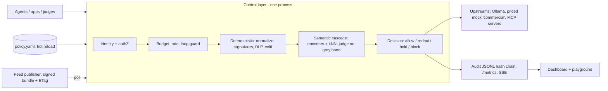

# 00 - Summary: SOT knowledge base for the AI Control Layer

Synthesis of 01-06 (research run 2026-10-03, read-only, nothing measured locally). Every claim is sourced in the numbered file named in brackets. Scope and judging come from the issuer PDF "CRIETRIA AI Control Layer", which wins over anything here. This is input for the plan, not a decision.

## Product in one line
One policy-driven control layer that every agent interaction passes through (agent->LLM, agent->MCP tool, app->agent). It authenticates the agent, meters and caps spend, runs fast deterministic checks and then a small-model semantic cascade, and decides allow / redact / hold / block. Inputs: one hot-reloaded `policy.yaml` and a signed external signature feed. Outputs: an audit log, metrics and a dashboard.

## Established (decision-relevant)

### Scope and taxonomies
- Map controls to OWASP LLM Top 10 2025 (the issuer's reference), OWASP Top 10 for Agentic Applications 2026 (ASI01-ASI10, published 2025-12-09), OWASP MCP Top 10 (v0.1 beta) and MITRE ATLAS v5.6.0 agent-era IDs (T0086 exfiltration via agent tool invocation, T0110 tool poisoning, T0109 rug pull, T0034.002 agentic resource consumption). [01]
- A 2026 edition of the OWASP LLM Top 10 exists (2026-08-03, reordered IDs) but its IDs were not extracted from the PDF. OWASP Agent Control Standard (2026-09-01, Apache-2.0) defines allow/deny/modify verdicts with fail-open default. [01, 06]
- Candidate catalog: 25 controls in 8 families (INJ, DLP, EXF, TOOL, MCP, MEM, A2A, ART), each with one allowed and one blocked test prompt. 14 deterministic, demo-strong controls form the fallback deliverable: INJ-01/02/03, DLP-01/02/03, EXF-01/02/03/04, TOOL-03/05, MCP-01/02. [01]

### Exfiltration (user priority 1)
- Real exfiltration runs through rendering and tools. EchoLeak (CVE-2025-32711) beat Microsoft's injection classifier and link redaction (reference-style Markdown, auto-fetched images); the fix was deterministic blocking of the channel. Controls: EXF-01 markdown/image/link host allowlist on responses, EXF-02 egress allowlist on tool calls (blocks 169.254.169.254, RFC1918, loopback), EXF-03 argument shape (base64 blobs, earlier secret hits inside args), EXF-04 taint (untrusted content + private data in context => deny or hold external egress). [01]
- Classifiers fail both ways: up to 100% evasion by character injection against Prompt Shield / Prompt Guard, about 60% accuracy on benign trigger-word text (NotInject). Normalize first (NFKC, Unicode tags U+E0000-E007F, zero-width, bidi), decode base64/hex/rot13 and rescan, then classify. [01, 03]
- Biggest false-positive lever: channel-aware thresholds (instruction-like text is graded in user turns but blocked in tool results, RAG, web). Add mention-vs-use separation and a benign corpus with security-engineer questions and Polish text. [01]
- Polish DLP: Presidio (MIT) ships only PL_PESEL; NIP, REGON, IBAN-PL and ID card need regex + checksum. spaCy `pl_core_news_*` is GPL-3.0, do not ship it. [01, 03]

### Signature feed and historical attacks (user priority 2)
- Rule format: own YAML schema (draft `aicl-rules/1` in 04: id, version, severity, OWASP/ATLAS/CVE mapping, stage, match = regex/keywords/yara/semantic/purl, action, inline positive/negative tests) compiled to RE2 + Aho-Corasick + YARA-X. NOVA (MIT, v0.3.1) is the closest prompt-rule format; import its rules with a converter rather than adopting it (stdlib regex, no signed updates). [04]
- Stdlib `re` is ReDoS-able: `(a+)+$` on 26 chars took 2.48 s on Python 3.14. Feed regexes run on RE2 (`google-re2`, cp314 arm64 wheels). YARA-X 1.21 (BSD-3) works on 3.14, yara-python does not. [04]
- Feed pattern (freshclam, suricata-update): a separate publisher serves an Ed25519-signed bundle over HTTP with ETag; the gateway polls, verifies, rejects rollback, runs the inline rule tests, swaps atomically, keeps last-good and reports feed version and age. An unsigned local override layer (`source=local`) lets judges edit rules live while a tampered upstream bundle is still rejected. [04]
- Feed sources: MITRE ATLAS data (Apache-2.0, 73 dated case studies), CISA KEV JSON (LiteLLM x3, Langflow x6, MLflow, Ray), OSV/GHSA with ETag, OpenSSF malicious-packages. A vendored snapshot is mandatory for offline tests and demo. [04]
- 30 verified historical attacks with signal and rule idea are in 04, e.g. CVE-2025-32434 torch.load, CVE-2024-3660 / CVE-2025-1550 Keras Lambda, CVE-2024-37032 Probllama (Ollama), CVE-2025-3248 Langflow, CVE-2025-6514 mcp-remote, CVE-2025-49596 MCP Inspector, CVE-2025-53109/53110 filesystem MCP, CVE-2025-10894 s1ngularity/Nx (abused AI CLIs), the picklescan bypass family, LiteLLM PyPI 1.82.7/1.82.8 malware (GHSA-5mg7-485q-xm76, 2026-03). [04]
- Claim "pickle blocked by default", never "pickle scanned safe": picklescan has 20+ bypass advisories. YARA on raw bytes still matches nullifAI-style broken pickles. [04]

### Budget and token misuse (user priority 3)
- Ollama OpenAI-compat sends final stream usage only with `stream_options.include_usage`; `num_predict` defaults to infinite; NUM_PARALLEL=1. The gateway injects include_usage, clamps max_tokens and num_ctx, strips logprobs/logit_bias and keeps its own concurrency semaphore. Interrupted streams lose usage: settle with an estimate (`usage_source=estimated`) and sweep orphan reservations. [05]
- Existing gateways price local models at $0 and exempt them from budgets (LiteLLM, Bifrost, agentgateway). Differentiator: meter local models in GPU-seconds from Ollama eval durations, with a USD-equivalent rate knob. The "commercial" provider is a priced mock upstream (no paid APIs allowed) using real prices from the LiteLLM price JSON (MIT). [02, 05]
- Enforcement: hierarchical budgets (org/team/agent/key/session), reserve worst case then settle; single-process SQLite `BEGIN IMMEDIATE` + conditional UPDATE is atomic enough; token bucket / GCRA in-process; downgrade to a cheaper model before a hard block. Redis 8 is RSAL/SSPL/AGPL (Valkey or nothing). [05]
- Runaway thresholds with precedent: OpenHands stuck detector (4 identical action-observation pairs, 3 errors, 6 ping-pong), Agents SDK `max_turns` 10, LangGraph `recursion_limit` 25. [05]
- Token-misuse signals for the budget-analysis view: token velocity per agent vs its baseline, sponge prompts ("repeat forever"), context stuffing, model-upgrade attempts outside the allowlist, burn-rate forecast to period end. [05] `[INFERENCE]` for the composite view.

### Identity, tools, MCP
- Tier 0: per-agent opaque keys (sha256 stored); a header/claim mismatch = 403 impersonation. Tier 1: short-lived JWT (pinned alg, aud, scope, act, delegation depth). SPIFFE/SPIRE is too heavy. [05]
- MCP spec 2026-07-28: no protocol sessions (the gateway mints its own session id), token passthrough forbidden, tool annotations untrusted. Risk class (read / write / irreversible) comes from our policy. HITL approval = single-use row bound to (session, tool, args_hash). [02, 05]
- Tool poisoning, rug pull and shadowing are deterministic to catch: scan `tools/list`, pin hash(name, description, schema), quarantine on drift. [01]

### Build vs buy
- Own FastAPI gateway around a transport-agnostic `decide(event, policy)` core: score 4.00, low risk (recommended). agentgateway (Apache-2.0, Rust, v1.6.0, budgets + MCP + A2A) scored 4.35 but carries medium-high risk and a second config surface; it fits as a stretch adapter. LiteLLM scored 2.95: per-key guardrails and audit logs are Enterprise, 28 advisories in 2026 including the malicious PyPI release. [02]
- Dead or unusable as a base: LLM Guard (archived 2026-07), TensorZero (archived 2026-06), Rebuff, Vigil, Portkey OSS (no budgets), Kong OSS (AI features Enterprise). Reusable parts: Presidio (MIT), gitleaks rules (MIT, 222), Cisco mcp-scanner YARA rules, Vigil YARA files, NOVA rules. [02, 04]
- No product hot-reloads one YAML across budgets + guardrails + models: we write the watcher (mtime polling is enough). [02, 06]

### Semantic models (32 GB M5 shared with the other project)
- No single model covers injection + exfil intent + harm + PII; injection encoders do not detect exfiltration intent. [03]
- Shortlist: PIGuard (MIT, 184M, best over-defense on NotInject at 87.3%) and Wolf Defender v2 (Apache-2.0, ONNX, 2048 ctx) as encoders; bge-m3 (MIT, 1.2 GB, 100+ languages) kNN over a Polish-augmented attack corpus; judge = clef-flash via Ollama `/v1/systemone` (yes/no probabilities, editable questions) or qwen3.5:4b; optional Qwen3Guard 0.6B (Apache-2.0, 119 languages) for harm. [03]
- Excluded: Prompt Guard 2 / Llama Guard (gated Llama license, EU multimodal clause for LG4, no Polish; third-party PG2-22M recall 0.44), ShieldGemma (Gemma terms), gpt-oss-safeguard-20b (14 GB). [03]
- Cascade: stage 0 deterministic (<2 ms), stage 1 parallel encoders + kNN + Presidio (20-80 ms), stage 2 judge only on the gray band or untrusted channels (0.3-1.2 s). Extra RAM: Lean ~2.5 GB, Standard ~4.5 GB. Latencies are `[INFERENCE]`. [03]
- "Adherence %": strictness profiles defined by target benign FPR on our dev set (strict 5%, balanced 1%, permissive 0.1%); resolved thresholds live in `policy.yaml` with a judge band between allow and block. [03]
- Docker has no Metal: ONNX encoders on CPU in-process, LLMs on native Ollama via host.docker.internal; `/health` announces degraded mode when a model is missing. [03]

### Proof for judges
- pytest driven by one YAML per control (allowed + blocked cases), mock upstream by default (no models, fast), markers fast/semantic/live/redteam, and a meta-test that fails if a control lacks an allow or a block case. JUnit + HTML + coverage matrix go to `reports/`. Config tests: removing a control lets its negative case through; invalid YAML keeps last-good and logs `config_reload_rejected`. [06]
- garak (Apache-2.0, 0.17.0) before/after (raw Ollama vs gateway) is the third-party robustness number. promptfoo red-team generation sends prompts to its cloud unless disabled; PyRIT, DeepTeam and Giskard need a judge LLM (skip). [06]
- Reporting: JSONL audit with hash chain, CEF/syslog export, documented OCSF/ECS/OTel mapping (no stable AI guardrail class anywhere: claim "mapped", not "compliant"), Prometheus `aicl_*`, `Server-Timing` per-control latency header. [06]
- Dashboard: FastAPI + SSE + vendored Chart.js served by the gateway (2-4 h), with a policy tab and a playground for judges' ad-hoc prompts. Grafana optional via /metrics (AGPL). [06]
- Demo: scripted OpenAI Agents SDK agent (MIT) plus opencode (MIT) as an unmodified third-party agent; reference MCP servers (filesystem, fetch) plus our own inert fake email/payments MCP server (FastMCP). Replayable MCP CVEs: CVE-2025-53109/53110 (filesystem), CVE-2025-68143/44/45 (mcp-server-git). Skip Open WebUI (branding clause, non-OSI). [06]

## Inconsistent
- OWASP LLM IDs: issuer cites 2025, a 2026 edition reorders them. Carry 2025 IDs + ASI 2026 + ATLAS; add 2026 LLM IDs only if someone reads the PDF. [01, 06]
- Prompt Guard 2: Meta 97.5% recall at 1% FPR vs PINT 78.8% vs third-party recall 0.44 with 21% hard-benign FPR. [03]
- Vendor-only numbers: Wolf Defender, eu-pii-safeguard, Qwen3Guard, clef-flash latency. [03]

## Could not establish
- Any latency or RAM measured on this M5; Polish injection-detection quality of any model; whether Ollama `eval_count` includes qwen3.5 thinking tokens; garak runtime on our setup; A2A agent-card signing rules. [01, 03, 05, 06]

## Risks carried into the plan
- False positives on judges' benign security questions are the largest scoring risk (robustness = 30%). [01, 06]
- Ollama and 32 GB unified memory are shared with the other project: model swaps and latency spikes in stage 2. The demo must pass on the deterministic path alone. [03, 06]
- The feed is an attack surface: a bad or ReDoS rule can block all traffic. Mitigate with RE2 only, signatures, inline rule tests, a benign-corpus gate and a per-rule circuit breaker. [04]
- Streaming: redaction is impossible once bytes have left; own SSE reassembly is the likeliest demo bug. [02]
- Judges using plain curl send no session key, so stateful controls (taint, loops) need a fallback key. [01]

## Endpoint focus (08-10, added 2026-10-03 17:00)
Scope changed to employees' endpoints sending traffic from the internal network to external AI; the design is in 07 v2.

**Web apps [08]**
- ChatGPT web: prompt in `POST /backend-api/f/conversation` (`messages[].content.parts[]`, SSE answer). Uploads go through `POST /backend-api/files`, then a presigned `PUT` to `*.oaiusercontent.com`, then `/uploaded`. Logged-out use runs on `/backend-anon/`, which OpenAI says to block on corporate networks.
- Claude web: `.../chat_conversations/{id}/completion` with `prompt`. The only wrapper is stale, so the shape is unverified.
- Gemini web: form `f.req` with JSON inside JSON. The only wrapper is AGPL: read it, do not copy it.
- Copilot consumer: a WebSocket. Microsoft advises bypassing inspection for M365 Copilot.
- ChatGPT desktop and mobile pin their certificates (pin exceptions phased out 2026-02), so they can only get app control. Claude Desktop trusts the OS store.
- Spike: Cloudflare challenged curl and headless Chrome even without our proxy. A headed, logged-in Chrome through the proxy is untested; it is spike S1 and decides precise vs generic adapters.
- DLP must run on parsed string leaves, not raw bytes: Netskope's DLP broke on JSON escapes. Zscaler inspects ChatGPT messages and attachments inline and drops WebSocket traffic it cannot inspect.

**Onboarding, identity, legal [09]**
- Routing: an explicit PAC URL (never WPAD). Chrome passes only the host to https PAC scripts.
- QUIC: Chrome does not trust enterprise roots over QUIC, so block UDP/443 and set `QuicAllowed=false`.
- CA: a name-constrained CA works with mitmproxy 12.2.3 only with `upstream_cert=false` (spike). On macOS 13+ a manually installed .mobileconfig root is not SSL-trusted, so the demo uses `security add-trusted-cert`.
- The demo Mac is MDM-enrolled (Mosyle): rehearse onboarding on the real laptop.
- Identity: mitmproxy `proxyauth` is Basic only, and Electron apps cancel proxy-auth prompts. The IP map plus agent registration is the practical identity.
- Verified tenant headers: `ChatGPT-Allowed-Workspace-Id`, `anthropic-allowed-org-ids`, `OpenAI-Allowed-Organization-Ids`, `X-GoogApps-Allowed-Domains`, `sec-Restrict-Tenant-Access-Policy`, `sec-GitHub-allowed-enterprise`. The Google and Microsoft headers require decrypting sign-in hosts.
- Legal:
  - GDPR art. 6(1)(f) with a balancing test, and a DPIA;
  - Labour Code art. 22^2 §6-8: notice at least 14 days before go-live; art. 22^3 §4;
  - WP249: decrypt narrowly, log on incident;
  - retention 90 days metadata / 30 days content is an inference, needs lawyer sign-off.

**Catalog, uploads, DLP, usage [10]**
- Catalog seed: v2fly `category-ai` (MIT) is the only maintained permissive list; the others are GPL/AGPL, unlicensed or stale.
- Gemini shares hosts with the rest of Google, so the catalog needs host + path matching.
- Measured costs:
  - Magika 2 ms;
  - docx 19 ms, xlsx 35 ms, pptx 4.6 ms extraction;
  - label read 0.04 ms;
  - PII regex with checksums 0.12 ms / 10 KB;
  - EDM over 1M records: 53 MB, lookup <0.01 ms.
- A 1028:1 zip bomb exists in practice, so check ZipInfo first, use defusedxml, and extract in a worker process.
- Purview labels live in `docProps/custom.xml` (`MSIP_Label_*`) or in `LabelInfo.xml`. RMS-encrypted content is unreadable, so it falls under the `unscannable` policy.
- Token estimates: tiktoken o200k works offline. Claude and Gemini counts are estimates.
- Key governance: the OpenAI and Anthropic admin APIs expose key hints, so keys can be matched without storing them.
- Avoid: python-stdnum (LGPL), PyMuPDF (AGPL), python-magic (needs libmagic), ai4privacy and piiranha datasets (non-commercial).
