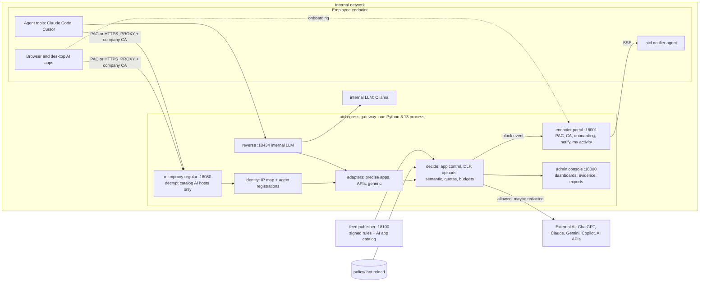
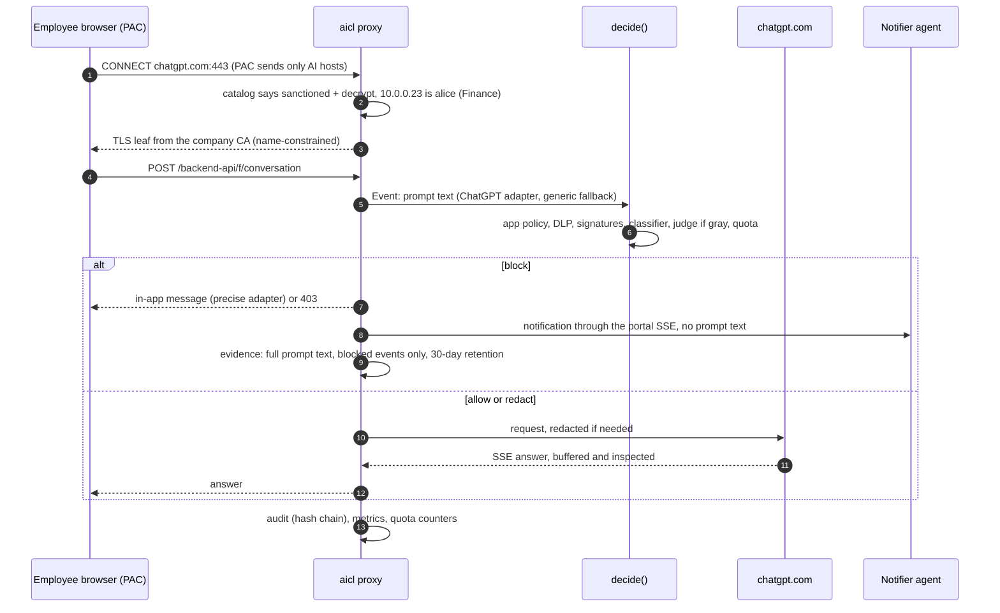

# 07 - Architecture and tech stack (PROPOSAL v2: employee endpoints -> external AI, traced to the issuer PDF)

Proposal 2026-10-03 17:10 CEST. Inputs:
- issuer PDF "CRIETRIA AI Control Layer" = source of truth, cited as PDF §N;
- team decisions:
  - 6 people, own Python gateway, buffer-inspect-re-stream, blueprint-lite, English-language detectors;
  - focus: normal employees' endpoints sending traffic from the internal network to external AI;
  - precise support for ChatGPT web + desktop, Claude web + desktop, Gemini web, Copilot web and AI APIs;
  - PAC + company CA, IP-to-user map;
  - block + native notification from an endpoint agent;
  - full text stored for blocked events only;
  - upload content + sensitivity labels;
  - agents as a secondary layer on the same path;
- research 00-10, cited as [NN].

Versions and licences were checked on PyPI / npm / HF / GitHub on 2026-10-03 (PDF §5: "check the license"). `[INFERENCE]` = reasoning or target, not measured. `[SPIKE]` = run by research on this Mac.

Contents: §0 scope and threats, §1 PDF traceability, §2 architecture views, §3 tech stack, §4 decisions, §5 performance / failures / security / privacy / scale, §6 controls, §7 contracts, §8 policy, §9 feed and catalog, §10 data model, §11 ports and onboarding, §12 spikes, §13 demo, §14 cut list.

## 0. Scope and threat model
The gateway sits at the internal network's egress to external AI. It decrypts only AI destinations from a signed catalog, knows the employee from the IP map, and enforces app control, DLP on prompts and uploads, acceptable use, quotas and budgets. It tells the employee what happened through a native notification. Agent tools on the same endpoints (Claude Code, Cursor, MCP clients) use the same path and get a secondary layer of tool and loop controls. An internally hosted LLM (Ollama behind a reverse port) covers the PDF's local-model budget.

| Threat (endpoint scope) | Example | Main controls |
|---|---|---|
| Data leakage in prompts | customer list with IBANs pasted into ChatGPT | DLP-01/02/06/07, SEM-01 |
| Data leakage in uploads | board deck labelled Confidential uploaded to Claude | UPL-01, DLP-09, DLP-01/02/05 |
| Shadow AI and personal accounts | DeepSeek (data stored in the PRC), personal ChatGPT login | APP-01, APP-02 |
| Acceptable-use violations | jailbreaking a sanctioned assistant, harmful requests | INJ-01..04, SEM-01 |
| Inbound risk in answers | hallucinated or malicious package names, exfil links | HIST-01, EXF-01 |
| Cost and token misuse | scripted bulk use, huge pastes, expensive models | GOV-03/04/05 |
| Agents on endpoints (secondary) | `curl x | sh` tool call, loops, poisoned tool descriptions | TOOL-02, EXF-02, MCP-01, TOOL-05 |
| Model supply chain (developers) | pickle model from Hugging Face | ART-01 |

## 1. PDF rules -> design (traceability)

| PDF | Rule | Our answer | Proof for judges |
|---|---|---|---|
| §2, §3.1 | gateway / proxy that is easy to integrate | Inspecting egress proxy: endpoints opt in with a PAC URL + company CA (MDM/GPO in production), no app changes; agent tools via the same proxy; internal LLM via a reverse port | Demo laptop browser + a second endpoint |
| §3.1a | own or existing agent for the showcase | Real AI web apps used by people; Claude Code or an OpenAI SDK agent through the same proxy (secondary) | Demo §13 |
| §3.1b | architecture diagram | §2.1, PNG in the README | T-610 |
| §4.1 | single config source: controls, thresholds (block vs redact, adherence %), allowed models, budgets | `policy/` (hot reload 1 s): identity map, per-department app overrides, controls + profiles, allowed models, quotas and budgets, privacy | Config tests T-205 |
| §3.2 | documented policy with strictness levels and budget rules | Annotated `contracts/policy.example.yaml`: 3 profiles, per-department rules, per-user/department quotas | Policy guide T-610 |
| §4.2.1 | deterministic: PII / secrets patterns, authentication / access checks | DLP-01/02/06/07/09, uploads, app control by catalog, identity map, tenant-restriction headers | Per-control YAML cases |
| §4.2.2 | semantic, AI-based | In-process ONNX classifier + signature kNN; local LLM judge for confidential business information | `semantic` cases + calibration report |
| §2 | speed vs semantic depth | Cascade with short-circuit; judge only on the gray band (§5.1) | `Server-Timing`, perf report |
| §2, §4.3 | budgets for commercial and local models; compute time, token spend | Per-user/department quotas (prompts, estimated tokens), API spend in USD, internal LLM GPU-seconds, rate and size limits, agent loop caps | Budget cases; Usage page |
| §1 | authentication, impersonation, irreversible actions | Identity map + agent registration; tenant restrictions (corporate vs personal accounts); agent tool guards (secondary) | Cases; Users page |
| §1 | input validation, output filtering | Prompt DLP and acceptable use on input; answers checked for exfil links and malicious packages | Cases |
| §1 | memory, runaway loops, high consumption | Agent loop breaker, quotas, anomaly signals (huge paste, bulk, off-hours) | Cases; Usage page |
| §2, §4.4 | historical exploits, signatures from an external system | Signed feed: jailbreak families, slopsquatting / malicious package names, exfil patterns, HF pickle scan, exploit patterns in agent tool calls, internal LLM admin shield | Exploit replay + feed tests |
| §2, §4.5 | reporting for security and management; real-time metrics; exportable audit | Management: shadow-AI share, departments, prevented events, equivalent cost. Security: user / app / event drill-down, audited evidence reveal. JSONL hash chain, CEF / CSV, Prometheus | Dashboards; `aicl audit verify` |
| §3.3 | dashboard: controls, posture, blocked threats, cost | Posture, Threats, Shadow AI, Users, Usage, Performance, Feed & Policy pages | Live demo |
| §3.4, §4.6 | executable positive + negative suite incl. budgets and exploits | pytest + YAML cases per control, recorded app fixtures replayed offline, synthetic labelled documents, meta-test | `make test` -> `reports/` |
| §6 | zero-prep tests; ad-hoc prompts; live config / feed edits; telemetry | Offline default run; judges type into real AI apps on the demo laptop or the playground; 1 s policy reload, 10 s feed poll | Demo, tests |
| §5 | check OSS licences | All runtime dependencies permissive (§3) | §3 table |
| §7 | no paid APIs; local models | People use free tiers of web apps in the demo; APIs simulated; internal LLM on Ollama | Offline tests |

## 2. Architecture

### 2.1 Logical view



### 2.2 Lifecycle of a browser prompt


Uploads follow the same path as a separate stage (§4 D13). ChatGPT sends file bytes in a different request (presigned PUT) from the prompt, so the verdict is cached per file id.

### 2.3 Deployment
- **Demo network:** a phone hotspot or travel router, because venue Wi-Fi client isolation blocks LAN traffic.
- **Demo Mac:**
  - runs the gateway (`aicl up`), the feed publisher and the internal LLM;
  - is also endpoint 1;
  - a teammate laptop is endpoint 2 with a different IP, so a different user and department.
- **Production:**
  - gateway replicas near the egress;
  - PAC URL and CA pushed by MDM / GPO / Intune;
  - IP map fed from DHCP + AD logon events or from the notifier agents;
  - an egress firewall that lets only the gateway reach AI FQDNs and drops UDP/443;
  - Chrome/Edge policy `QuicAllowed=false`;
  - Valkey (counters) + Postgres (ledger, evidence, index);
  - SIEM export.

### 2.4 Destination coverage

| Destination | Inspection | Prompt | Uploads | On block | Tier |
|---|---|---|---|---|---|
| ChatGPT web | precise: `POST /backend-api/f/conversation`, `messages[].content.parts[]`, SSE answer [08] | yes | `POST /backend-api/files` -> presigned `PUT *.oaiusercontent.com` -> `/uploaded` [10] | in-app message + notification | 1 |
| ChatGPT desktop / mobile | none: certificate-pinned (OpenAI doc; pin exceptions phased out 2026-02) [08, 09] | no | no | app control by SNI (allow or deny) + notification | 1 (control only) |
| Claude web + desktop | precise: `POST /api/organizations/{org}/chat_conversations/{id}/completion`; schema unverified until S1; desktop trusts the OS store [08] | yes | multipart `/upload`, `/convert_document` [10] | in-app message + notification | 1 |
| Gemini web | precise decode of form `f.req` (JSON inside JSON), generic redaction [08] | yes | multipart push to `content-push.googleapis.com` [10] | 403 + notification | 2 |
| Copilot web (consumer) | precise WebSocket frames `wss://copilot.microsoft.com/c/api/chat` [08] | yes | `POST /c/api/attachments` [10] | drop frame + notification | 2 |
| M365 Copilot | none: Microsoft advises bypassing TLS inspection [08] | no | no | app control + tenant restriction (documented) | doc |
| AI APIs (OpenAI, Anthropic, Gemini API) | precise documented formats; developers and agent tools | yes | files APIs | provider-shaped error + notification | 1 (Gemini API 2) |
| Other catalog AI apps (Perplexity, DeepSeek, Mistral, Grok, Meta AI, ~120 domains) | generic adapter or app control only | generic | generic | block page / 403 + notification | 1 |
| Hugging Face (developers) | ART-01 artifact scan | - | - | 403 + notification | 2 |
| Internal LLM | reverse port, OpenAI-compatible and native Ollama | yes | - | error + notification | 1 |

## 3. Tech stack (verified 2026-10-03)

| Layer | Choice | Version | Licence | Role |
|---|---|---|---|---|
| Runtime / packaging | CPython 3.13, uv workspace + `uv.lock` with hashes, ruff | 3.13 / 0.12.x / 0.16.10 | PSF / Apache-2.0 or MIT / MIT | one async process, pinned deps |
| Proxy engine | mitmproxy (regular on LAN, reverse for internal LLM) | 12.2.3 | MIT | TLS, HTTP/2, WebSocket frames, async hooks |
| Portal, console, API | FastAPI + uvicorn (two apps, same loop) | 0.142.2 / 0.54.0 | MIT / BSD-3 | endpoint portal :18001, admin console :18000, SSE |
| UI | Jinja2 + htmx + Chart.js, vendored | 3.1.6 / 2.0.11 / 4.5.1 | BSD-3 / 0BSD / MIT | no frontend build |
| Config | PyYAML + pydantic | 6.0.3 / 2.13.5 | MIT / MIT | policy and catalog schemas |
| Signatures | google-re2 + pyahocorasick + yara-x | 1.1.20251105 / 2.3.1 / 1.21.0 | BSD-3 / BSD-3 / BSD-3 | linear-time regex, dictionaries, artifact rules |
| Upload typing | filetype + Magika | 1.2.0 / 1.0.3 | MIT / Apache-2.0 | magic bytes; content type and source-code detection (~2 ms [10]) |
| Document text | pypdf, python-docx, openpyxl, python-pptx + defusedxml | 6.19.0 / 1.2.0 / 3.1.5 / 1.0.2 / 0.7.1 | BSD-3 / MIT / MIT / MIT / PSF | text + MSIP labels; worker process with caps |
| Secret rule data | gitleaks rules | pinned commit | MIT | secrets incl. OpenAI / Anthropic / HF keys |
| Token estimates | tiktoken, o200k offline cache | 0.14.0 | MIT (repo; PyPI field empty) | estimated tokens for web apps, labelled `est` |
| ML runtime | onnxruntime CPU + tokenizers + numpy | 1.30.0 / 0.23.2 / 2.5.3 | MIT / Apache-2.0 / BSD-3 | in-process stage 1, no torch |
| Classifier | Wolf Defender v2 small (ONNX on HF) | 2026-09-25 | Apache-2.0, ungated | jailbreak / injection = acceptable use |
| Embeddings | bge-small-en-v1.5 (ONNX on HF) | 2024-02 | MIT, ungated | feed semantic signatures (kNN) |
| Judge and internal LLM | Ollama 0.35.1 with `qwen3.5:4b` (or `clef-flash`) | 0.35.1 | MIT / Apache-2.0 | confidential-information judge on the gray band; the internal LLM destination |
| Feed crypto | cryptography (Ed25519) | 50.0.2 | Apache-2.0 OR BSD-3 | signed rules + catalog bundles |
| AI app catalog seed | v2fly/domain-list-community `category-ai` | pinned commit | MIT (keep NOTICE) | ~120 AI domains [10] |
| State | SQLite WAL (stdlib) | 3.x | public domain | ledger, quotas, evidence, registrations, audit index |
| Metrics / export | prometheus-client, stdlib json / csv / SysLogHandler (CEF) | 0.26.0 | Apache-2.0 AND BSD-2 / PSF | telemetry, SIEM |
| Endpoint notifier | Python stdlib + `osascript` (macOS) / PowerShell toast (Windows) / `notify-send` (Linux); terminal-notifier optional | - | PSF / MIT | native notifications, identity registration |
| CA bundle for CLI tools | certifi | 2026.7.22 | MPL-2.0, unmodified | public roots + company CA |
| Tests | pytest + pytest-asyncio + pytest-html; openai + anthropic SDKs as real clients | 9.1.1 / 1.4.0 / 4.2.0; 3.24.0 / 1.11.0 | MIT / Apache-2.0 / MPL-2.0; Apache-2.0 / MIT | offline suite with recorded fixtures |
| Agent demo (secondary) | openai-agents (or Claude Code through the proxy) | 0.23.1 | MIT | tool-call controls |
| Red team (stretch) | garak, separate venv | 0.17.0 | Apache-2.0 | API path before / after |

Licence posture:
- All runtime dependencies are permissive. MPL-2.0 appears only unmodified (certifi, pytest-html).
- Avoided: python-stdnum (LGPL), PyMuPDF (AGPL), python-magic (needs libmagic), the AGPL Gemini wrapper (read only, never copied), GPL/AGPL domain lists, CC-BY-NC datasets [08, 10].
- Rejected bases (unchanged from v1): LiteLLM, agentgateway / Envoy / Kong OSS, LLM Guard / Rebuff / Vigil / TensorZero, NeMo Guardrails, Guardrails AI, Prompt Guard 2 / Llama Guard, Redis 8, Grafana as a requirement [02, 03].

## 4. Decisions

| # | Decision | Why |
|---|---|---|
| D1 | Scope = internal-network egress to external AI: employee endpoints first, agent tools on the same endpoints second, internal LLM for local budgets | team focus; PDF agentic + §4.3 kept |
| D2 | Routing = explicit PAC URL listing catalog AI hosts -> proxy, everything else DIRECT; never WPAD / DHCP 252; env vars for CLI and agent tools | [09]; least decryption; Chrome sends only host to https PAC [SPIKE] |
| D3 | mitmproxy regular mode on LAN `:18080` with `upstream_cert=false`, `connection_strategy=lazy`, `allow_hosts` = catalog decrypt list | constrained CA needs `upstream_cert=false` [SPIKE, 09] |
| D4 | Company CA X.509 name-constrained to the decrypt list + `aicl.test`; demo trust via `security add-trusted-cert` (a manually installed .mobileconfig root is not SSL-trusted on macOS 13+); production via MDM / GPO / Intune / Firefox `ImportEnterpriseRoots` | [09]; demo Mac is MDM-enrolled, rehearse |
| D5 | QUIC off: UDP/443 drop on the demo network + `QuicAllowed=false`; HTTP/3 not available in regular mode | Chrome ignores enterprise roots over QUIC [09] |
| D6 | Identity = policy IP map (CIDR allowed) + live registrations from the notifier agent; fallback `anonymous` with the strictest profile; `proxyauth` optional (Electron apps cannot answer proxy auth) | team choice; [09] |
| D7 | App control = signed catalog (`aicl-catalog/1`, v2fly seed + curated apps), host + path matching, actions sanctioned / coach / unsanctioned / unreviewed, per-department overrides in policy | [10]; Gemini shares Google hosts |
| D8 | Adapters: the generic adapter first (string leaves of JSON / form / multipart / WebSocket text, nested JSON up to 3 levels, in-place redaction); precise adapters check their expected path and shape and fall back to generic on drift (`adapter_drift` event) | [08]; Netskope DLP broke on JSON escapes, so scan parsed leaves |
| D9 | ChatGPT desktop / mobile: pinned, so tunnel + allow / deny by SNI. Claude desktop: same adapter as web if spike S6 shows OS-store trust | [08, 09] |
| D10 | M365 Copilot: no decryption (Microsoft guidance); app control + documented tenant restriction | [08] |
| D11 | Tenant restrictions: inject verified headers `ChatGPT-Allowed-Workspace-Id`, `anthropic-allowed-org-ids`, `OpenAI-Allowed-Organization-Ids`; block ChatGPT `/backend-anon/` (logged-out use); Google `X-GoogApps-Allowed-Domains` and Microsoft TRv2 need sign-in host decryption, so documented only (stretch `inject_only`) | [09, 10]; demo against the simulator, no real enterprise tenants |
| D12 | On violation: block. Precise apps show an in-app message, others a 403 or a block page; the notifier agent shows a native notification (app, control, reason, link to "my activity"), never prompt text | team choice |
| D13 | Uploads = separate stage keyed on upload host/path: size gate in `requestheaders` (25 MB scan cap), spool, filetype + Magika, ZipInfo bomb guard, defusedxml, MSIP label read, extraction in a worker process (5 s, 2 MB text cap), same detectors, verdict cached per file id / sha256; `unscannable: block | allow_audit` | [10]; streamed bodies cannot be modified |
| D14 | Human DLP set: DLP-01 secrets + API-key registry, DLP-02 PII incl. EU/PL identifiers with checksums, DLP-05 source code (Magika), DLP-06 dictionaries (codenames, customers), DLP-07 exact data match (HMAC-SHA256/96), DLP-08 fingerprints (stretch), DLP-09 labels and markings | [10] measured costs |
| D15 | Semantic: stage 1 in-process ONNX (Wolf small for jailbreak / injection, bge-small for feed signatures); judge on the gray band for confidential business information and harmful requests, datamarked input, yes/no output, never lowers a deterministic block | PDF §4.2.2 [03] |
| D16 | Streaming: buffer, inspect, re-stream for SSE; WebSocket inspected per frame; `ws_policy: inspect | drop` for frames we cannot parse | team choice; Zscaler drops uninspectable WebSocket [08] |
| D17 | Privacy: decrypt only AI hosts; metadata + labels for every event; full prompt / file text only for blocked events, 30-day retention, separate 0600 store; reveal needs the security role + a reason and is itself audited; management sees department aggregates; employees see their own events at `/me` | team choice; GDPR minimisation [09] |
| D18 | Usage: quotas per user and department (prompts/day, estimated tokens/day); API spend in USD from responses (pinned price map); internal LLM GPU-seconds; "equivalent cost" for web apps (labelled); anomalies: huge paste, bulk / automation, off-hours, upload burst, app sprawl, key sharing, non-entitled model | PDF §4.3 [05, 10] |
| D19 | Policy = `policy/` dir, pydantic, 1 s reload, last-good, one snapshot per request, `policy_version` everywhere | PDF §4.1, §6 |
| D20 | Feed = signed bundle with rules + catalog + semantic signatures; verify, anti-rollback, expiry, inline tests, atomic swap, last-good; catalog swap regenerates the PAC and decrypt list | PDF §2 [04] |
| D21 | Historical attacks for this scope: jailbreak families, slopsquatting / malicious package names in answers (OpenSSF malicious-packages), exfil links in answers, HF pickle artifacts, exploit patterns in agent tool calls, internal LLM admin shield (Probllama class) | PDF §4.4 [04] |
| D22 | Agents (secondary): API adapters expose tool definitions, calls and results to TOOL-02, EXF-02, MCP-01 and TOOL-05; no separate MCP proxy | stdio MCP is visible only through LLM traffic |
| D23 | State = SQLite WAL; evidence in its own file | single process [05] |
| D24 | Two web apps on one loop: endpoint portal `:18001` (LAN, IP-scoped, no login) and admin console `:18000` (admin token) | separates employee-facing from admin surfaces |
| D25 | Tests: offline, recorded + sanitized app fixtures replayed by a simulator, synthetic labelled Office/PDF files, YAML cases per control, meta-test | PDF §6 |
| D26 | Bypass prevention documented: egress firewall (AI FQDNs only from the gateway), UDP/443 drop; DoH / ECH irrelevant with an explicit proxy, and no AI host publishes ECH today | [09] |

## 5. Non-functional design

### 5.1 Performance budget (targets `[INFERENCE]`, verified by T-902)

| Stage | Target added p95 | Mechanism |
|---|---|---|
| identity + catalog lookup | < 0.5 ms | in-memory snapshot |
| prompt rules + DLP (<= 10 KB) | < 3 ms | RE2 / Aho-Corasick linear time; PII regex 0.12 ms / 10 KB [10] |
| stage 1 semantic | < 60 ms | ONNX CPU thread pool, cache by content hash |
| judge (gray band only) | < 1.5 s, timeout 3 s | fail mode per control |
| upload 1-5 MB Office file | < 150 ms | Magika 2 ms, docx 19 ms, xlsx 35 ms [10] |
| total prompt overhead without judge | < 80 ms | `Server-Timing` header |

### 5.2 Failure modes

| Failure | Behaviour |
|---|---|
| precise adapter sees an unexpected shape | generic adapter handles the flow; `adapter_drift` event on the dashboard |
| Cloudflare / Google challenge page | passed through untouched, never "blocked" by us |
| file unscannable (encrypted, password PDF, > 25 MB) | `unscannable` policy (default `block` for strict, `allow_audit` for permissive) |
| notifier agent offline | in-app message / 403 / block page still shown; notification queued for 10 min |
| IP not in the map | user `anonymous`, strictest profile, event flagged |
| policy invalid / feed tampered / rule broken / detector error / Ollama missing | last-good, reject, disable rule, fail mode, degraded `/health` (as in v1) |

### 5.3 Security of the gateway
- Least decryption with a name-constrained CA, so a leaked key only covers AI hosts; key 0600, never committed.
- Cookies, `Authorization`, `Proxy-Authorization` and API keys never logged.
- Admin console behind a token, portal IP-scoped.
- Evidence store separate and short-lived.
- Feed signed. Parsers sandboxed (worker process, caps, defusedxml, ZipInfo guard).
- Pickles never loaded.
- `uv.lock` with hashes.

### 5.4 Privacy and legal (EU / Poland) [09]
- **Lawful basis and assessment:** GDPR art. 6(1)(f) with a documented balancing test (not consent), and a DPIA (UODO list).
- **Labour Code (Kodeks pracy):**
  - written notice to employees at least 14 days before go-live (art. 22^2 §6-8);
  - art. 22^3 §4 as the basis for other forms of monitoring.
- **WP249:** decrypt narrowly and log on incident.
- **Product defaults that follow:**
  - AI hosts only;
  - full text only for blocked events, 30-day retention, metadata 90 days;
  - audited reveal;
  - no emotion or per-employee scoring for management;
  - a monitoring notice on the onboarding page and at `/me`.
- Lawyer sign-off is a production prerequisite, not a demo blocker.

### 5.5 Scalability (documented, not built)
- Stateless gateway replicas behind an L4 balancer.
- Valkey Lua for quota and budget counters; Postgres for the ledger, evidence and index; audit shipped to a SIEM.
- Policy from Git with CI validation; feed from a CDN.
- IP map from DHCP / AD logon events.
- Stage 1 can move to a worker pool.

## 6. Control catalog

| ID | Control | Applies to | Type | Piece | Tier |
|---|---|---|---|---|---|
| ID-01 | Identity: IP map, agent registration, anonymous fallback | all | D | w1 | 1 |
| APP-01 | AI app control by catalog (sanctioned / coach / unsanctioned / unreviewed, per department) | all AI hosts | D | w1 | 1 |
| APP-02 | Tenant restriction headers, block logged-out ChatGPT | ChatGPT, Claude, OpenAI API | D | w1 | 2 |
| INJ-01/02 | Unicode normalization, decode and rescan | prompts | D | w3 | 1 |
| INJ-03 | Jailbreak / injection signatures (acceptable use) | prompts | D | w3 | 1 |
| INJ-04 | Semantic jailbreak / injection (classifier + signature kNN) | prompts | S | w5 | 1 |
| SEM-01 | Confidential business information + harmful request judge | prompts, upload text | S | w5 | 2 |
| DLP-01 | Secrets + API-key registry (corporate vs personal keys) | prompts, uploads, API | D | w3 | 1 |
| DLP-02 | PII incl. EU/PL identifiers (PESEL, NIP, REGON, IBAN, Luhn) | prompts, uploads | D | w3 | 1 |
| DLP-05 | Source code | prompts, uploads | D (Magika) | w3 | 2 |
| DLP-06 | Custom dictionaries: project codenames, customer names | prompts, uploads | D | w3 | 1 |
| DLP-07 | Exact data match against hashed customer records | prompts, uploads | D | w3 | 2 |
| DLP-08 | Document fingerprints of protected documents | prompts, uploads | D | w3 | 3 |
| DLP-09 | Sensitivity labels (MSIP) and CONFIDENTIAL markings | uploads, prompts | D | w3 | 1 |
| UPL-01 | Upload gate: size, type, bomb guards, unscannable policy | uploads | D | w1 + w3 | 1 |
| EXF-01 | Exfil links / markdown images in answers | answers | D | w3 | 2 |
| HIST-01 | Slopsquatting / malicious package names in answers | answers | D | w3 | 2 |
| ART-01 | Model artifact scan (pickle opcodes, YARA-X) | HF downloads | D | w3 | 2 |
| INFRA-01 | Internal LLM admin endpoint shield | internal LLM | D | w1 | 2 |
| GOV-03 | Quotas and budgets: user / department, prompts, est. tokens, USD, GPU-s | all | D | w5 | 1 |
| GOV-04 | Rate, body size, wall clock, internal LLM concurrency | all | D | w5 | 1 |
| GOV-05 | Usage anomalies | all | stats | w5 | 2 |
| TOOL-02 / EXF-02 / MCP-01 | Agent tool guards: dangerous commands, egress allowlist, tool-description poisoning | agent API traffic | D | w3 | 2 |
| TOOL-05 | Agent loop breaker | agent API traffic | D | w5 | 2 |

## 7. Contracts (interface files, lead writes them in hour 1)
`contracts/aicl_contracts.py`, `policy.example.yaml`, `rules.md` (`aicl-rules/1` [04]), `catalog.md` (`aicl-catalog/1` [10]), `case.example.yaml`, `audit.md` (incl. evidence and reveal), `PORTS.md` (ports, endpoint onboarding).

```python
Stage = Literal["navigation", "request", "upload", "response", "tool_def", "tool_call", "tool_result", "artifact", "infra"]
Action = Literal["allow", "monitor", "redact", "coach", "block"]          # severity order

class Who(BaseModel):
    user: str; department: str; device: str | None; ip: str; source: Literal["ip_map", "agent", "proxyauth", "anonymous"]

class Event(BaseModel):
    id: str; ts: float; session_id: str; who: Who; stage: Stage
    app_id: str; app_action: str      # from the catalog: sanctioned / coach / unsanctioned / unreviewed
    adapter: str                      # chatgpt_web, claude_web, gemini_web, copilot_web, openai_api, ..., generic
    host: str; path: str; model: str | None
    channel: Literal["user", "system", "assistant", "tool", "web", "unknown"]
    parts: list[Part]                 # text leaves with a JSON path, so redaction can write back in place
    upload: UploadInfo | None = None  # file_id, sha256, mime, size, label, scannable
    tool: ToolInfo | None = None      # agent traffic only
    usage: Usage | None = None        # tokens (reported or est), usd, gpu_seconds

class Finding(BaseModel):
    control_id: str; rule_id: str | None; score: float; action: Action
    spans: list[Span] = []; evidence: str; latency_ms: float; error: str | None = None

class Control(Protocol):
    id: str; stages: set[Stage]
    async def check(self, event: Event, ctx: Ctx) -> list[Finding]: ...
```

## 8. Policy model

```yaml
# policy/policy.yaml (abridged)
version: 1
profile: balanced                       # strict | balanced | permissive
identity:
  ip_map:
    10.0.0.23: {user: alice, department: Finance}
    10.0.0.31: {user: bob, department: Engineering}
    10.0.0.0/24: {user: unknown-lan, department: Unassigned}
  allow_agent_registration: true
  unknown: anonymous                    # strictest profile
apps:                                   # overrides on top of the signed catalog
  default_unreviewed: coach
  departments:
    Engineering: {allow: [chatgpt, claude, copilot, openai_api, anthropic_api], deny: [deepseek]}
    Finance: {allow: [copilot], deny: [chatgpt_personal, deepseek, perplexity]}
  tenant:
    chatgpt: {workspace_id: "ws-demo-123", block_logged_out: true}
    anthropic: {org_ids: ["org-demo-456"]}
controls:
  DLP-01: {mode: block}
  DLP-02: {mode: block}
  DLP-06: {mode: block, terms: [Project Falcon, Acme Holdings]}
  DLP-09: {mode: block, labels: [Confidential, Highly Confidential]}
  UPL-01: {mode: block, max_scan_mb: 25, unscannable: block}
  INJ-03: {mode: block}
  INJ-04: {mode: block, threshold: profile, fail: open}
  SEM-01: {mode: block, threshold: profile, fail: open}
profiles:
  strict:     {INJ-04: 0.35, SEM-01: 0.40}
  balanced:   {INJ-04: 0.60, SEM-01: 0.65}
  permissive: {INJ-04: 0.85, SEM-01: 0.85}
quotas:
  department:
    Finance: {prompts_day: 400, est_tokens_day: 400000}
    Engineering: {prompts_day: 2000, est_tokens_day: 3000000, api_usd_day: 25.00}
  user_default: {prompts_day: 150, est_tokens_day: 150000}
models:
  gpt-4o-mini: {provider: openai, usd_per_mtok_in: 0.15, usd_per_mtok_out: 0.60}   # pinned from LiteLLM JSON
  qwen3.5:4b: {provider: ollama, local: true}
local_compute: {gpu_usd_per_hour: 0.50}  # labelled assumption
privacy:
  store_full_text: blocked_only
  evidence_retention_days: 30
  metadata_retention_days: 90
  reveal_requires_reason: true
notifications: {enabled: true, include_reason: true, link: "http://aicl.lan:18001/me"}
feed: {url: "http://127.0.0.1:18100/bundle", pubkey: "...", poll_s: 10, on_stale: keep_last_good}
```
Semantics (unchanged from v1):
- `local.d/*.yaml` merged in lexical order.
- 1 s reload; invalid -> last-good + `config_reload_rejected`.
- One snapshot per request; a missing control block = `off`.
- `threshold: profile` reads the active profile. A department or user can override `profile`.

## 9. Signature feed and AI app catalog
- The signed bundle (Ed25519, ETag, served on `:18100`) carries three kinds of data, each with inline positive / negative tests:
  - `rules/*.yaml` (`aicl-rules/1`);
  - `catalog/*.yaml` (`aicl-catalog/1`: app id, host + path matchers, category, risk 0-100 with reason codes, default action, decrypt flag, adapter kind, tenant header);
  - `semantic/*.yaml` (example phrases).
- Gateway loop:
  1. poll;
  2. verify;
  3. reject rollback, expiry and hash mismatches;
  4. compile and run the tests;
  5. swap atomically;
  6. regenerate the PAC and decrypt list;
  7. emit `feed_applied` / `feed_rejected`.
- `policy/local.d/` holds unsigned local overrides for live judge edits.
- Catalog seed: v2fly `category-ai` (MIT) + ~10 curated apps with risk facts, e.g.:
  - ChatGPT Free trains by default;
  - DeepSeek stores data in the PRC [10].

## 10. Data model (SQLite)

| Table | Key columns |
|---|---|
| `registrations` | `ip`, `user`, `device`, `hostname`, `first_seen`, `last_seen` (from notifier agents) |
| `counters` | `scope` (user / department / org), `scope_id`, `window`, `metric` (prompts / est_tokens / usd / gpu_s), `spent`, `reserved` |
| `ledger` | `request_id`, `ts`, `user`, `department`, `app_id`, `model`, `tokens`, `token_source` (reported / est), `usd`, `gpu_seconds` |
| `uploads` | `file_id`, `sha256`, `app_id`, `mime`, `size`, `label`, `verdict`, `ts` |
| `evidence` (separate file, 0600) | `event_id`, `ts`, `user`, `app_id`, `controls`, `full_text`, `expires_at` |
| `reveals` | `event_id`, `revealed_by`, `reason`, `ts` (also an audit event) |
| `notifications` | `event_id`, `ip`, `user`, `delivered_at` |
| `api_keys` | `hmac`, `owner`, `department`, `kind` (corporate / personal-seen) |
| `audit_index` | `seq`, `ts`, `request_id`, `user`, `app_id`, `stage`, `action`, `controls`, `policy_version`, `feed_version`, `hash` |

## 11. Ports and endpoint onboarding

| Port | Bind | Purpose |
|---|---|---|
| 18080 | LAN | forward proxy |
| 18001 | LAN | endpoint portal: `/onboard`, `/proxy.pac`, `/ca.cer`, `/notify` (SSE, IP-scoped), `/me` |
| 18000 | 127.0.0.1, or LAN with admin token | admin console, `/metrics`, `/health` |
| 18100 | 127.0.0.1 | feed publisher |
| 18434 | LAN | internal LLM reverse proxy |
| 18200 | 127.0.0.1 | demo fixtures |

All verified free; avoid 5432, 8080, 8085, 4317-4318, 11434, 16686, 55432, 59000-59001.

Endpoint steps (demo, macOS):
1. Open `http://<gw>:18001/onboard`. It shows the monitoring notice and the steps below.
2. `curl -o aicl-ca.cer http://<gw>:18001/ca.cer && sudo security add-trusted-cert -d -r trustRoot -p ssl -p basic -k /Library/Keychains/System.keychain aicl-ca.cer`.
3. System Settings > Network > Proxies > Automatic proxy configuration = `http://<gw>:18001/proxy.pac`.
4. `defaults write com.google.Chrome QuicAllowed -bool false`, then restart Chrome.
5. `python3 aicl_notify.py --portal http://<gw>:18001` (LaunchAgent plist in production).
6. Check: `http://aicl.test/` shows user and department.

CLI and agent tools also need `HTTPS_PROXY` + `SSL_CERT_FILE` (bundle) + `NODE_EXTRA_CA_CERTS`.

## 12. Spikes (hour 1)

| # | Owner | Question |
|---|---|---|
| S1 | w1 + w4 | Headed, logged-in Chrome (human, own accounts) through the proxy with the constrained CA: do chatgpt.com, claude.ai, gemini.google.com and copilot.microsoft.com work, or does Cloudflare tie clearance to the browser TLS fingerprint? Send one benign prompt + one upload per app and save sanitized fixtures. This decides precise vs generic per app |
| S2 | w1 | `DumpMaster` + two uvicorn apps in one asyncio loop |
| S3 | w5 | Wolf / bge-small ONNX latency on M5; judge latency and quality on 20 labelled confidential / benign examples |
| S4 | w6 | Native notification on macOS (`osascript` vs terminal-notifier), stdlib SSE client, LaunchAgent |
| S5 | w3 | Magika, pypdf, python-docx, openpyxl, python-pptx, defusedxml, yara-x, re2 on 3.13 arm64; MSIP label read from one real labelled docx (teammate supplies) |
| S6 | w1 | ChatGPT.app and Claude.app through the proxy: pinned or not |

## 13. Demo script (employee personas, 6 min)
1. **Onboarding:** endpoint 2 opens `/onboard`, trusts the CA and sets the PAC; `http://aicl.test/` shows "bob, Engineering".
2. **Prompt DLP:** Alice (Finance) pastes a customer list with IBANs into ChatGPT web. It is blocked with an in-app message, a macOS notification appears, and the Threats page shows the event; the security view reveals the full text with a reason, and the reveal is audited.
3. **Upload DLP:** Alice uploads a Purview-labelled "Confidential" pptx to Claude. Blocked + notification (DLP-09).
4. **Engineering:** Bob pastes code with an AWS key into Gemini. DLP-01 blocks it.
5. **Semantic:** Bob paraphrases the "Project Falcon" acquisition plan into Copilot without any codename. SEM-01 judge blocks it.
6. **Shadow AI:** opening chat.deepseek.com shows the block page with the approved alternative. The Shadow AI page shows apps, departments and the sanctioned share.
7. **Tenant control:** the logged-out ChatGPT path `/backend-anon/` is blocked; the workspace header is visible in the audit.
8. **Agents (secondary):**
   - Claude Code on Bob's laptop tries `curl x | sh` and TOOL-02 blocks it;
   - a loop trips TOOL-05;
   - the Engineering API budget goes to 429;
   - internal LLM GPU-seconds show on the Usage page.
9. **Live config by a judge:**
   - allow Perplexity for Finance;
   - flip DLP-02 to `redact`;
   - publish a new catalog entry and signature: blocked within 10 s;
   - tamper with the bundle: rejected.
10. **Telemetry and audit:** `Server-Timing`, p95 overhead, CEF export, `aicl audit verify`.

## 14. Cut list (in this order)
1. Copilot WebSocket adapter (generic + app control remain)
2. Gemini precise decoder
3. Google / Microsoft tenant headers
4. DLP-08 fingerprints
5. agent controls beyond TOOL-02 + loop breaker
6. KEV / OSV / ATLAS fetchers
7. DLP-07 exact data match
8. judge tier (keep stage 1)
9. Windows / Linux notifier (keep macOS)
10. garak

Never cut:
- PAC + CA onboarding, IP map, app control, the generic adapter;
- ChatGPT + Claude precise adapters;
- DLP-01/02/06/09 + uploads;
- the macOS notifier;
- policy hot reload, the offline suite, the audit chain + evidence retention.
